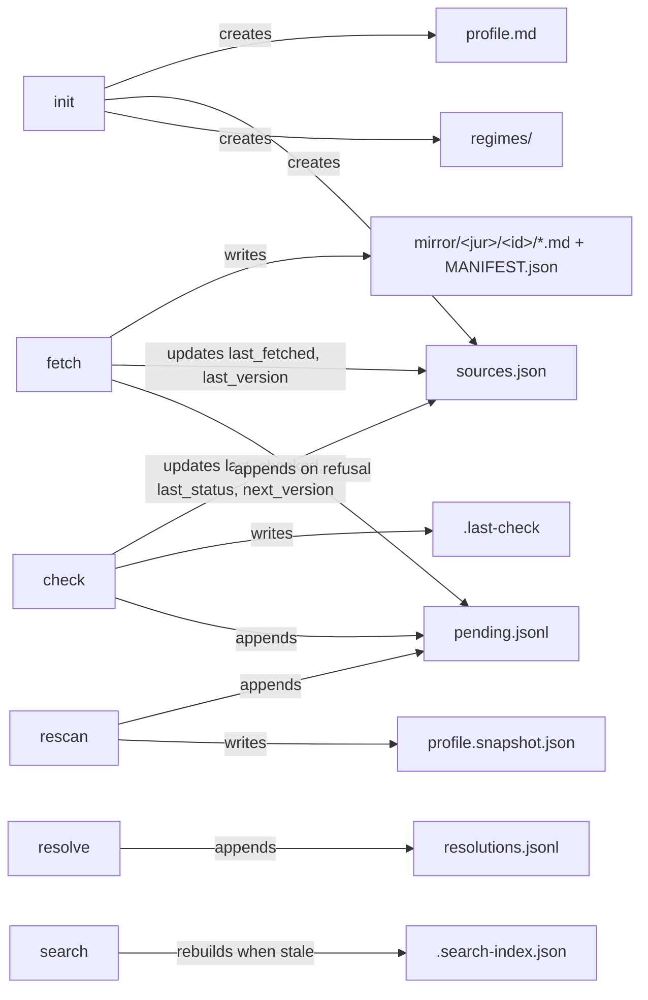

# CLI Reference

> Last updated: 2026-09-20
> Entry point: `bin/compliance-register` (Python >= 3.12 + PyYAML; no install step, the launcher puts the repo on `sys.path` — `bin/compliance-register:16-17`)

All commands run **inside a project**: the tool walks upward from the current directory until it finds a `knowledge-base/` directory and works only under `<root>/knowledge-base/compliance/` (`compliance_register/paths.py:26-35`). Terminal I/O lives in `compliance_register/cli.py`; every sink passes through `render.printable` so mirrored or hand-written text cannot repaint the terminal (`compliance_register/render.py:48`, `tests/test_cli.py:88-105`).

## Exit codes

| Code | Meaning | Where decided |
|------|---------|---------------|
| 0 | done | each `cmd_*` in `compliance_register/cli.py` |
| 1 | failure: bad argument or no subcommand (argparse's 2 is remapped), validation problems found, unknown pending id, unreadable `profile.md`/`sources.json`, `check` with an unreachable source, `fetch` where a guard or HTTP refused | `compliance_register/cli.py:228-232`, `:241-243` |
| 2 | refused: not in a project, unsafe path, Python < 3.12, PyYAML or CA certificates missing, nothing to check, refuse-tier or unconfirmed source named, profile does not validate (`rescan`) | `bin/compliance-register:9-26`, `compliance_register/cli.py:235-240` |

`--version` prints `compliance-register 0.1.0` (`compliance_register/cli.py:187`, `compliance_register/__init__.py:1`).

## Files the commands touch



Nothing edits `profile.md` or a regime file after `init`; changes are recorded in `pending.jsonl` for a human to resolve (`compliance_register/pending.py:1-4`).

## Commands

### `init`

Scaffolds `knowledge-base/compliance/`: `regimes/`, `mirror/` with a `.gitignore` containing `.private/`, an empty `profile.md` (all 15 answers `unanswered`), `sources.json` as `{"schema": 1, "sources": []}`, and `.search-index.json` appended to `knowledge-base/compliance/.gitignore`. Idempotent; existing files are left alone (`compliance_register/cli.py:22-40`, `tests/test_cli.py:26-39`). Exit 0.

### `status [--json]`

Reports counts, never a verdict: profile presence/problems/age in days, regime counts by status, obligations registered and unclear (no `You must` or `It says`), open pending by severity, unreadable pending lines, the `.last-check` timestamp and per-regime problems (`compliance_register/status.py:24-44`, render `:47-68`, unclear `compliance_register/regimes.py:26-28`). Exit 0.

### `pending [--json]`

Lists open entries — rows in `pending.jsonl` whose id has no row in `resolutions.jsonl` (`compliance_register/pending.py:82-84`). Text form: `id  severity  kind  summary` (`compliance_register/cli.py:60-61`); prints `no pending changes` when empty. Exit 0.

### `resolve <id> --action applied|dismissed|deferred --by <name> [--note <text>]`

Appends one row to `resolutions.jsonl` (`compliance_register/pending.py:87-96`, `ACTIONS` at `:13`). Exit 1 with `unknown pending id` when the id is not in `pending.jsonl`, or with `<id> is already resolved` (`compliance_register/cli.py:65-75`). Prints `<id> <action> by <name>` on success.

### `search <query> [-k N] [--kind regime|mirror|profile] [--json]`

BM25 over every non-dotfile `*.md` under the compliance directory, including `mirror/.private/` (`compliance_register/search.py:62-69`, scoring `:118-149`). The index at `.search-index.json` is rebuilt when the (path, size, mtime) signature of the markdown set differs from the stored one (`compliance_register/search.py:96-107`). `-k` defaults to 5. Output: `score  kind  path` then an indented snippet; `no hits — try the source's own vocabulary` when empty (`compliance_register/cli.py:78-88`). Exit 0.

### `profile validate`

Prints one line per problem: missing or unknown dimension, bad status, `unanswered`, `confirmed but value is null`, and `confirmed_by`/`confirmed_at` required once every answer is confirmed (`compliance_register/profile.py:53-77`). Exit 1 if any problem or no `profile.md`, else 0 (`compliance_register/cli.py:91-99`).

### `profile diff --against <file-or-git-ref>`

Prints the dimension slugs whose `value` differs between the current `profile.md` and either a file path or `git show <ref>:knowledge-base/compliance/profile.md` (`compliance_register/cli.py:102-124`, `compliance_register/profile.py:80-87`). The ref is passed after `--end-of-options`, so a ref that looks like a git flag is never interpreted as one (`compliance_register/cli.py:107`, `tests/test_cli.py:126-135`). Exit 1 when git fails or there is no profile, else 0.

### `regimes validate`

Loads every `regimes/*.md` and prints `<id>: <problem>` for each finding (rules below). An unreadable file reports `unreadable: …` instead of stopping the run (`compliance_register/regimes.py:94-112`). Exit 1 on any problem, else 0 (`compliance_register/cli.py:127-132`).

### `sources validate`

Validates every entry in `sources.json` (rules below). Exit 1 on any problem, else 0 (`compliance_register/cli.py:135-139`). Invalid JSON or the wrong top-level shape raises `SourcesError` → exit 1 (`compliance_register/sources.py:128-141`).

### `fetch [--source <id>]... [--force] [--today YYYY-MM-DD]`

Acquires or refreshes sources into the mirror. Without `--source`, every source with `status: confirmed`; with it, only the named ids — and each must be confirmed or the run is refused before any request (`compliance_register/fetch.py:17-26`, `compliance_register/sources.py:104-115`). Validation runs before network. `--force` rewrites pages whose hash or lastmod is unchanged. On success sets `last_fetched` and, when the adapter reports one, `last_version` (`compliance_register/fetch.py:50-53`). Output: `written N · skipped N · refused N` plus a per-source detail line.

Exit: **2** when validation refused or a refuse-tier source was named explicitly; **1** when any guard or HTTP refusal occurred (a `source-unreachable` pending entry is added once per source); **0** otherwise (`compliance_register/fetch.py:31-49`, `tests/test_fetch.py:20-65`).

### `check [--source <id>]... [--json] [--today YYYY-MM-DD]`

The cheapest question per confirmed source: did it move? Three-valued — `fresh`, `moved`, `unreachable` (`compliance_register/mirror/adapters/__init__.py:15-16`). Refuse-tier sources are skipped. Per result it appends a pending entry (`source-moved` major, `source-unreachable` info, `source-next` info for a scheduled future consolidation), deduplicated against open entries; then updates `last_checked`/`last_status`/`next_version`, writes `.last-check`, adds `date-passed` for watched regimes whose `review_by` <= today, and `profile-stale` when something moved after the profile was confirmed (`compliance_register/check.py:37-88`). `check` never writes `last_version` — only `fetch` does, after the content guards (`compliance_register/check.py:1-3`).

Exit: **2** with `nothing to check — no confirmed sources`, or when validation/confirmation refused (no request made); **1** when at least one source was unreachable; **0** when every source is fresh or moved (`compliance_register/check.py:40-50`, `:78-79`, `tests/test_check.py:130-144`). Text output ends with `see: compliance-register pending` when anything moved or was unreachable.

### `rescan [--today YYYY-MM-DD]`

Compares the **confirmed** answers in `profile.md` to `profile.snapshot.json`; a proposed value never advances the baseline (`compliance_register/rescan.py:38-44`). First run writes the snapshot and reports nothing. Afterwards, per changed dimension: if the new value is falsy, every `binds`/`undetermined` regime whose `applies.triggered_by` names that dimension gets a `regime-gone` (major) entry; otherwise one `regime-new` (info) entry names the touched regimes (`compliance_register/rescan.py:46-57`). Output: `changed: a, b · pending entries written: N`. Exit **2** with `profile does not validate: …` when `profile validate` would fail; **1** with `no profile.md`; else 0 (`compliance_register/cli.py:163-168`).

### Shared options

- `--today YYYY-MM-DD` (`fetch`, `check`, `rescan`) — the date written into `sources.json`, `.last-check` and pending rows and compared as a string; anything else is rejected with exit 1 (`compliance_register/cli.py:176-182`, `tests/test_cli.py:138-143`).
- `--json` (`status`, `pending`, `search`, `check`) — the report dict as JSON on stdout.

## File formats

### `profile.md`

YAML frontmatter + free-text body. `answers` has exactly the 15 dimension slugs, in order: `establishment, directed_activity, users, legal_form, size, sector, licences, exchanged, money_flow, personal_data, third_parties, third_party_content, role, automation_ai, time_change` (`compliance_register/profile.py:12-28`).

```yaml
schema: 1
confirmed_by: null        # required once every answer is confirmed
confirmed_at: null        # YYYY-MM-DD; status uses it for age, check for profile-stale
answers:
  establishment: {value: null, status: unanswered, evidence: []}   # status: unanswered | proposed | confirmed
```

### `regimes/<id>.md`

Filename must equal `id` (`compliance_register/regimes.py:109-110`). Required frontmatter keys: `id, title, status, jurisdiction, sources, confirmed_by, confirmed_at` (`compliance_register/regimes.py:13`). `status` is `binds | ruled-out | undetermined | no-longer-applies`. `sources` is a list of `{id, version, retrieved}` whose `id` matches a `sources.json` entry (that link is how `check` computes `affects`, `compliance_register/check.py:19-21`). `binds` requires `applies.quote` and `applies.cite`; `ruled-out` requires `exempt.reason` and must list no obligations (`compliance_register/regimes.py:75-82`). Optional: `applies.triggered_by` (list of `{dimension: value}` or `"dimension: value"` strings, read by `rescan`) and `review_by` (YYYY-MM-DD, read by `check`).

Obligations sit under `## Obligations` as `### <ID> · <title>` headings (`-` also accepted as separator) followed by `- **Key:** value` bullets. Allowed keys: `When`, `You must`, `How often`, `It says`, `You'd know by`, `Note`; ids must be unique per file (`compliance_register/regimes.py:14-17`, `:83-90`; example in `tests/test_regimes.py:5-33`).

### `sources.json`

`{"schema": 1, "sources": [Source, ...]}`, rewritten atomically by `fetch` and `check` (`compliance_register/sources.py:144-155`). Source fields (`compliance_register/sources.py:28-49`):

| Field | Values / default | Notes |
|-------|------------------|-------|
| `id`, `jurisdiction`, `kind`, `url` | required; kind `legislation \| gazette \| regulator \| contract \| standard`; url must be `https` | `jurisdiction` and `id` become mirror path segments |
| `covers` | `""` | prose |
| `tier` | `api \| sitemap \| feed \| page-hash \| refuse`, default `page-hash` | `api` needs an explicit `adapter` |
| `adapter` | `eurlex \| sitemap \| feed \| pagehash`; defaults from tier | `eurlex` requires `config.celex` (base CELEX) and optional `config.language` |
| `config` | `{}` | adapter-specific (`urls` list for page-hash, `celex` for eurlex) |
| `change_signal` | `""` | prose |
| `licence` | `{redistribute: false, attribution: null}` | `redistribute` must be a bool; `false` routes the mirror to `mirror/.private/` |
| `allowed_hosts` | defaults to the url's host | redirects judged per hop; no localhost/private/link-local addresses |
| `headers` | `{user_agent: "default"}` | |
| `delay_seconds` | `10` | per-host politeness |
| `status` | `proposed \| confirmed \| unresolved`, default `proposed` | only `confirmed` is fetched/checked by default |
| `last_checked`, `last_status`, `last_version`, `next_version`, `last_fetched` | `null` | written by `check`/`fetch` |
| `evidence` | `[]` | why the agent proposed it |

### `pending.jsonl` and `resolutions.jsonl`

Append-only; state is derived by replay. A corrupt line is skipped and counted in `status` (`compliance_register/pending.py:22-40`). Ids are `chg-NNNN`, numbered across both files (`compliance_register/pending.py:64-67`).

```json
{"id": "chg-0001", "detected": "2026-09-20", "kind": "source-moved", "severity": "major", "source": "eu-eurlex-32016R0679", "affects": ["GDPR"], "summary": "…", "status": "pending", "from": "…", "to": "…", "changed": ["…"]}
{"id": "chg-0001", "resolved": "2026-09-21", "by": "Alex", "action": "applied", "note": ""}
```

`kind` ∈ `source-moved, source-unreachable, source-next, regime-new, regime-gone, date-passed, profile-stale`; `severity` ∈ `major, minor, info` (`compliance_register/pending.py:11-12`). Extra keys (`from`, `to`, `changed` — first 20 — with `changed_total`, `effective`) are set by `check` for moved/next entries (`compliance_register/check.py:65-73`).

### Mirror pages and `MANIFEST.json`

Pages live at `mirror/[.private/]<jurisdiction-lowercase>/<source id>/<relpath>.md` (`compliance_register/mirror/store.py:18-24`) with provenance frontmatter: `source, source_url, retrieved_at, content_hash (sha256 of whitespace-normalised text), licence, licence_name, attribution` plus adapter extras such as `lastmod` (`compliance_register/mirror/store.py:31-51`). One `MANIFEST.json` per source directory maps a page key (URL, feed entry id, or `<url>#art_N` for EUR-Lex articles) to `{"fetched", "lastmod", "hash", "path", "version"}` (`compliance_register/mirror/adapters/pagehash.py:61`, `compliance_register/mirror/adapters/eurlex.py:211`); `needs_refresh` compares `hash` when present, else `lastmod` on both sides (`compliance_register/mirror/store.py:81-88`).

### Derived files

`.last-check` holds one `YYYY-MM-DDTHH:MM:SSZ` line (`compliance_register/check.py:82`); `profile.snapshot.json` holds the confirmed answers by slug (`compliance_register/rescan.py:58`); `.search-index.json` is git-ignored and regenerated on demand.

## Related Documentation

- `SKILL.md` — the four-stage workflow the agent follows around these commands
- `references/dimensions-checklist.md` — the 15 profile questions
- Design rationale (D1, D7, D17–D19, D22) — the compliance-devkit design repo
