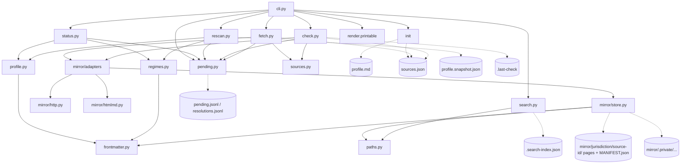

# Architecture

> Last updated: 2026-09-21

## Overview

`compliance-register` is a Claude Code skill with a Python CLI. It keeps a software project's applicable regulations locally available, dated, sourced and re-checked on command. It records what applies, why, what you must do and where it says so; it never verifies compliance (design repo, D15). Code lives in this repo; all data lives in the target project under `knowledge-base/compliance/` and is committed (D20).

The CLI is a thin shell: `compliance_register/cli.py:1` states "Terminal I/O and exit codes only; all logic lives in the other modules". There is no server, no database, no environment variable and no scheduler — commands, not schedules (D16).

Runtime: Python >= 3.12 (`bin/compliance-register:9`) and PyYAML (`pyproject.toml`). The launcher puts the repo on `sys.path` so no install step is needed (`bin/compliance-register:16-17`) and refuses to start with exit 2 when a prerequisite is missing (`compliance_register/preflight.py:9-16`, `bin/compliance-register:21-26`).

## System Diagram

## Core Components

### Entry and boundaries
- `bin/compliance-register` — launcher; version gate, `sys.path` insert, preflight, then `cli.main` (`bin/compliance-register:9-30`).
- `compliance_register/preflight.py` — prerequisite checks that must not raise (PyYAML present, CA certificates loaded) (`compliance_register/preflight.py:9`).
- `compliance_register/cli.py` — argparse subcommands `init`, `status`, `pending`, `resolve`, `search`, `profile validate|diff`, `regimes validate`, `sources validate`, `fetch`, `check`, `rescan` (`compliance_register/cli.py:185-221`). Maps `NotAProject`/`UnsafePath` to exit 2 and `FrontmatterError`/`SourcesError` to exit 1 (`compliance_register/cli.py:233-243`). Argparse's own exit 2 on a bad argument is rewritten to 1 (`compliance_register/cli.py:227-229`).
- `compliance_register/paths.py` — "the only module allowed to decide a path" (`compliance_register/paths.py:1`). `find_root` walks upward for `knowledge-base/` (`compliance_register/paths.py:26-31`); `contained` refuses any resolved path outside its base (`compliance_register/paths.py:38-45`); `safe_component` allows one ASCII segment with no leading dot (`compliance_register/paths.py:48-53`).
- `compliance_register/render.py` — `printable()`: escapes every non-printable codepoint at the terminal sink, copied verbatim from docs-mirror (`compliance_register/render.py:1-2`, `compliance_register/render.py:48`).

### Data files
- `compliance_register/frontmatter.py` — the only reader/writer of the YAML frontmatter block (`compliance_register/frontmatter.py:1-2`); atomic save via temp file + `os.replace` (`compliance_register/frontmatter.py:64-73`); YAML dates normalised to ISO strings once (`compliance_register/frontmatter.py:43-52`).
- `compliance_register/profile.py` — the 15 fixed dimensions in order (`compliance_register/profile.py:12-28`), each answer `{value, status, evidence}` with status `unanswered | proposed | confirmed` (`compliance_register/profile.py:30`, `compliance_register/profile.py:41-50`); `validate` and `diff` (`compliance_register/profile.py:53`, `compliance_register/profile.py:80`).
- `compliance_register/regimes.py` — one `regimes/<id>.md` per regime with status `binds | ruled-out | undetermined | no-longer-applies` (`compliance_register/regimes.py:12`); obligations parsed from `### <ID> · <title>` blocks of `- **Key:** value` bullets (`compliance_register/regimes.py:16-17`, `compliance_register/regimes.py:42-56`); a `binds` regime needs `applies.quote` and `applies.cite`, a `ruled-out` one needs `exempt.reason` and may list no obligations (`compliance_register/regimes.py:75-82`).
- `compliance_register/sources.py` — `sources.json`, the `Source` dataclass with tier, adapter, licence, `allowed_hosts`, freshness fields (`compliance_register/sources.py:28-49`); tiers `api | sitemap | feed | page-hash | refuse` (`compliance_register/sources.py:17`); `validate` requires https and refuses private/loopback hosts (`compliance_register/sources.py:86-93`, `compliance_register/sources.py:118-125`); `refusals` blocks a command-line-named source that no human confirmed (`compliance_register/sources.py:104-115`).
- `compliance_register/pending.py` — `pending.jsonl` and `resolutions.jsonl`, both append-only, state derived by replay (`compliance_register/pending.py:1-4`); kinds, severities and resolve actions (`compliance_register/pending.py:11-13`); ids `chg-NNNN` allocated from the max seen in both files (`compliance_register/pending.py:64-67`).

### Commands
- `compliance_register/status.py` — counts, profile age, open pending by severity, unreadable-line count, last check; "never a verdict (D1)" (`compliance_register/status.py:1-2`, `compliance_register/status.py:24-44`).
- `compliance_register/search.py` — BM25 over whole files, index at `.search-index.json` rebuilt when the `(relpath, size, mtime_ns)` signature changes (`compliance_register/search.py:3-6`, `compliance_register/search.py:73-107`); tokenizer copied from docs-mirror so query and document share one rule (`compliance_register/search.py:24-44`).
- `compliance_register/fetch.py` — acquire/refresh confirmed sources into the mirror; builds the per-source `Http` client (`compliance_register/fetch.py:10-14`).
- `compliance_register/check.py` — three-valued freshness per source; writes pending entries and stops; never writes `last_version` (`compliance_register/check.py:1-3`).
- `compliance_register/rescan.py` — profile drift against `profile.snapshot.json`, confirmed answers only (`compliance_register/rescan.py:1-4`, `compliance_register/rescan.py:41`).

### Mirror engine (`compliance_register/mirror/`)
- `http.py` — `Http.get` judges every redirect hop before taking it, upgrades an `http://` Location to https (never a plaintext request), caps body bytes, retries transient failures then raises `HttpUnreachable` (never "no change"), honours robots.txt per host with no allowlist (`compliance_register/mirror/http.py:1-5`, `compliance_register/mirror/http.py:142-176`). One process-wide politeness clock per host (`compliance_register/mirror/http.py:25-27`, `compliance_register/mirror/http.py:82-86`).
- `htmlmd.py` — stdlib-only HTML detection and HTML→markdown, copied verbatim from docs-mirror (`compliance_register/mirror/htmlmd.py:51-52`); `looks_like_html` (`compliance_register/mirror/htmlmd.py:128`) and `html_to_markdown`, which returns `None` rather than raising (`compliance_register/mirror/htmlmd.py:409`).
- `store.py` — markdown pages with provenance frontmatter (`source`, `source_url`, `retrieved_at`, `content_hash`, `licence`, `attribution`), one directory and one `MANIFEST.json` per source (`compliance_register/mirror/store.py:1-3`, `compliance_register/mirror/store.py:40-50`); `source_dir` routes non-redistributable sources under `mirror/.private/` (`compliance_register/mirror/store.py:18-24`); `needs_refresh` (`compliance_register/mirror/store.py:81-88`).
- `adapters/__init__.py` — registry `eurlex | sitemap | feed | pagehash`, each exposing `check()` and `fetch()` with the same shape (`compliance_register/mirror/adapters/__init__.py:1-2`, `compliance_register/mirror/adapters/__init__.py:11`); `CheckResult`/`FetchResult` (`compliance_register/mirror/adapters/__init__.py:14-29`); `prefetch` resolves the whole EUR-Lex basket once per run and never raises (`compliance_register/mirror/adapters/__init__.py:38-50`); `parse_xml` refuses any listing carrying a DTD (`compliance_register/mirror/adapters/__init__.py:53-59`).
- `adapters/sitemap.py` — `<lastmod>` per page is the change signal; one level of index recursion, capped at 50 children / 2000 pages (`compliance_register/mirror/adapters/sitemap.py:1`, `compliance_register/mirror/adapters/sitemap.py:12-14`).
- `adapters/feed.py` — RSS 2.0 or Atom; a new entry id is the change signal (`compliance_register/mirror/adapters/feed.py:1`).
- `adapters/pagehash.py` — for sources with no version id, sitemap or feed; `check()` has to fetch to compare and says so in its detail (`compliance_register/mirror/adapters/pagehash.py:1-2`, `compliance_register/mirror/adapters/pagehash.py:40-41`).
- `adapters/eurlex.py` — api tier; one SPARQL resolve against CELLAR per run, dated consolidated CELEX suffix as the change signal, five content guards G1–G5 before a byte is written, per-article chunking on `id="art_N"` (`compliance_register/mirror/adapters/eurlex.py:1-4`, `compliance_register/mirror/adapters/eurlex.py:184-196`, `compliance_register/mirror/adapters/eurlex.py:151-161`). The only address in the code is the protocol endpoint (`compliance_register/mirror/adapters/eurlex.py:18`, D28); the query template is `references/eurlex-resolve.sparql` (`compliance_register/mirror/adapters/eurlex.py:28`).

## On-disk layout in the target project

Written by `init` (`compliance_register/cli.py:22-40`) and the commands; everything under `<root>/knowledge-base/compliance/`:

| Path | Owner | Notes |
|------|-------|-------|
| `profile.md` | profile.py | 15 answers with evidence and confirmation state; committed |
| `profile.snapshot.json` | rescan.py | confirmed answers at last rescan (`compliance_register/rescan.py:12`) |
| `sources.json` | sources.py | `{schema: 1, sources: [...]}`; `check`/`fetch` update freshness fields |
| `regimes/<id>.md` | regimes.py | one per regime; filename must equal `id` (`compliance_register/regimes.py:109-110`) |
| `mirror/<jurisdiction>/<source-id>/*.md` + `MANIFEST.json` | store.py | redistributable text; committed |
| `mirror/.private/<jurisdiction>/<source-id>/...` | store.py | non-redistributable text; `mirror/.gitignore` lists `.private/` |
| `pending.jsonl`, `resolutions.jsonl` | pending.py | append-only; committed |
| `.last-check` | check.py | timestamp of the last `check` run (`compliance_register/check.py:82`) |
| `.search-index.json` | search.py | derived cache; listed in `compliance/.gitignore` (`compliance_register/cli.py:15`) |

## Data Flow

### `fetch`
1. Load `sources.json`; choose confirmed sources, or the ids named with `--source` (`compliance_register/fetch.py:18-19`).
2. Validate before any network call; a problem or an unconfirmed named source is a refusal, exit 2 (`compliance_register/fetch.py:21-26`).
3. `adapters.prefetch` resolves the EUR-Lex basket once (`compliance_register/fetch.py:29`).
4. Per source: a `refuse` tier is reported (exit 2 only if it was named explicitly) (`compliance_register/fetch.py:31-36`); otherwise the adapter's `fetch()` runs inside a `try` so one bad source cannot abort the rest (`compliance_register/fetch.py:37-40`). The adapter fetches via `Http.get`, converts with `htmlmd`, writes pages through `store.write_page` and saves its `MANIFEST.json` in a `finally` (`compliance_register/mirror/adapters/sitemap.py:67-94`).
5. Any refusal sets exit 1 and appends one `source-unreachable` entry if none is open for that source (`compliance_register/fetch.py:43-49`). `last_fetched` and `last_version` are updated only after a successful write (`compliance_register/fetch.py:50-53`), then `sources.json` is saved (`compliance_register/fetch.py:54`).

### `check`
1. Same selection and pre-network validation as `fetch`; `refuse` tier sources are excluded; no confirmed source is exit 2 (`compliance_register/check.py:38-50`).
2. Per source, the adapter's `check()` returns `fresh | unreachable | moved` plus optional `next_version` (`compliance_register/check.py:54-59`).
3. `moved` appends `source-moved` (major) with `from`/`to`/`changed`, deduped on `(kind, source, to)`; `unreachable` appends `source-unreachable` (info), deduped on `(kind, source)`; a scheduled future consolidation appends `source-next` (info) (`compliance_register/check.py:63-73`). `affects` lists the `binds`/`undetermined` regimes citing that source (`compliance_register/check.py:16-21`).
4. `last_checked`/`last_status` are written; any unreachable source makes exit 1 (`compliance_register/check.py:76-79`).
5. After the loop: regimes whose `review_by` has passed get a `date-passed` (major) entry (`compliance_register/check.py:28-34`); `.last-check` is written; if anything moved and the profile was confirmed before today, one `profile-stale` entry asks for a rescan (`compliance_register/check.py:81-87`).

### `rescan`
1. Load and validate the profile; missing profile is exit 1, invalid is exit 2, and no snapshot is written (`compliance_register/rescan.py:32-37`, `compliance_register/cli.py:163-168`).
2. Build `current` from confirmed answers only — a proposed value never advances the baseline (`compliance_register/rescan.py:41`).
3. First run: write the snapshot and report nothing (`compliance_register/rescan.py:42-46`).
4. Otherwise, per changed dimension, find regimes whose `applies.triggered_by` names it (`compliance_register/rescan.py:19-28`): a now-falsy value appends `regime-gone` (major) per touched `binds`/`undetermined` regime; any other change appends one `regime-new` (info) (`compliance_register/rescan.py:49-57`).
5. Write the new snapshot; no regime file is edited (`compliance_register/rescan.py:58`).

### `resolve`
`resolve <id> --action applied|dismissed|deferred --by <who> [--note]` appends one line to `resolutions.jsonl` after checking the id exists in `pending.jsonl` and is not already resolved (`compliance_register/pending.py:87-96`). `pending` lists entries whose id has no resolution (`compliance_register/pending.py:82-84`). Nothing is ever edited in place.

## Key Design Decisions

| Decision | Rationale | Alternatives Considered |
|----------|-----------|------------------------|
| Escape at the sink (`render.printable` at every CLI print) | Almost nothing printed was written by the tool: page bodies, hrefs, manifest paths. A terminal is a state machine; an ESC repaints it, U+202E reverses what is read. A sink is safe because of what it does, not because something upstream refused (`compliance_register/render.py:5-28`). | Refusing at the URL boundary only; `repr` (doubles backslashes, unreadable). |
| Per-hop redirect judging | Each `Location` is checked for scheme, `allowed_hosts`, robots.txt, control characters before it is followed, and an `http://` target is rewritten to `https://`; max 5 hops (`compliance_register/mirror/http.py:219-258`). robots.txt itself goes through the same loop minus the robots check, and may follow a redirect to another public host. Judging only the first URL lets a redirect walk to any host. | urllib's default follower. |
| Tiered acquisition `api → sitemap → feed → page-hash → refuse` | Use the cheapest reliable change signal a source offers; page-hash admits it must fetch to compare; `refuse` is a typed state, not an error (`compliance_register/sources.py:17`, `compliance_register/fetch.py:31-36`). | One generic crawler for everything. |
| Three-valued freshness `fresh / unreachable / moved` | "Could not reach" is not "not there": a transient failure is reported as `unreachable`, never as no change (`compliance_register/mirror/http.py:4-5`, `compliance_register/check.py:68-70`). | Boolean changed/unchanged. |
| Append-only jsonl for pending and resolutions | State by replay; a human reads either file top to bottom and never wonders what was edited (`compliance_register/pending.py:3-4`). Record, surface, delegate (D19). | Mutable state file; editing regime files automatically. |
| Poisoned files never brick a command | A corrupt pending line is skipped and counted (`compliance_register/pending.py:22-40`); an unreadable regime becomes a reported problem (`compliance_register/regimes.py:101-104`); a bad `MANIFEST.json` row is dropped (`compliance_register/mirror/store.py:54-64`); an adapter exception becomes an `unreachable` result (`compliance_register/check.py:58-59`); a poisoned search index cannot read outside the compliance dir (`compliance_register/search.py:141-145`). Verified in `tests/test_poisoned_files_do_not_brick.py`. | Fail fast on the first bad file. |
| Licence gating to `mirror/.private/` | Non-redistributable text is still mirrored and searchable locally, but routed to a directory `init` gitignores; `write_page` re-adds the ignore line if `init` never ran in a clone (`compliance_register/mirror/store.py:18-24`, `compliance_register/mirror/store.py:34-39`). | Refusing to mirror; committing everything. |
| robots.txt always honoured, no allowlist | D24; read per RFC 9309 — redirects followed (even cross-host), 4xx = no rules, 5xx/unreachable = host unreachable — matched by longest pattern with allow winning a tie (`_Robots`, not `urllib.robotparser`) and evaluated against our own product token as well as the UA sent; a disallow is a refusal (`compliance_register/mirror/http.py:87-130`, `:160-189`). | Operator override flag; fail-open on an unreadable robots.txt; stdlib first-match parsing. |
| Nothing law-specific in the skill | Sources are discovered by the agent and confirmed by a human (D17); the eurlex adapter carries only its protocol endpoint (D28) (`compliance_register/sources.py:1-3`, `compliance_register/mirror/adapters/eurlex.py:18`). | Shipping a curated source list. |
| Validation before network | `refusals` runs before any request in `fetch` and `check`; an unconfirmed source named on the command line is refused (`compliance_register/sources.py:104-115`). | Best-effort fetch and warn. |
| One politeness clock per host, process-wide | `check`/`fetch` build one client per source; twenty sources on one host must still wait between requests (`compliance_register/mirror/http.py:25-27`). | Per-client delay. |

## External Dependencies

| Dependency | Purpose | Version | Documentation |
|------------|---------|---------|---------------|
| Python | runtime | >= 3.12 (`pyproject.toml`) | https://docs.python.org/3/ |
| PyYAML | frontmatter parsing (`compliance_register/frontmatter.py:10`) | unpinned | https://pyyaml.org/ |
| pytest | tests, no network (`tests/fakehttp.py`) | dev only (`requirements-dev.txt`) | https://docs.pytest.org/ |
| docs-mirror (sibling skill) | `render.py`, `htmlmd.py` and the search tokenizer are verbatim copies; diff against upstream before editing | — | AlexSendula/docs-mirror |

## Related Documentation

- `SKILL.md` — command table, exit codes, agent rules
- `references/method-*.md` — the four stages as the agent runs them
- `references/dimensions-checklist.md` — the 15 profile questions
- Design repo `compliance-devkit` (sibling checkout, `design/`) — workflow v0.2, decisions D1–D29
