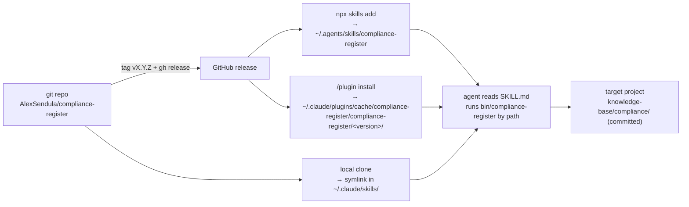

# Publishing & Release

> Last updated: 2026-09-20

compliance-register is a Claude Code skill, not a service. There are no
environments, servers, containers, environment variables, health checks or
monitoring — those template sections do not apply and are omitted. "Deploying"
means publishing a git tree that consumers copy onto their machine and invoke
by path (`SKILL.md:41-45`). All state lives in the *consumer's* project under
`knowledge-base/compliance/`, never in the skill directory (`README.md:52-72`).

## Current state

- Version `0.1.0`, pre-release. No git remote and no tags exist yet; the first
  release will be `v0.1.0` at `github.com/AlexSendula/compliance-register`.
- The default User-Agent already points at that repo
  (`compliance_register/mirror/http.py:30`), so the repository must be public
  before any consumer runs `fetch` or `check`, or the contact URL sent to
  source hosts is dead.

## Distribution



### What ships

The whole git tree: `SKILL.md`, `references/`, `bin/`, `compliance_register/`,
`tests/`, `.claude-plugin/`, `knowledge-base/`. Only `__pycache__/`, `*.pyc`,
`.pytest_cache/` and `.search-index.json` are excluded (`.gitignore:1-4`).
There is no build step and no wheel; `pyproject.toml:8-9` declares a console
script for `pip install .`, but that is not a supported channel — the launcher
is designed to run from any checkout without installation
(`bin/compliance-register:2-5`).

### Channel 1 — skills CLI (primary)

```bash
npx skills add AlexSendula/compliance-register
```

Copies the tree to `~/.agents/skills/compliance-register` and symlinks it into
`~/.claude/skills/` (the layout this machine shows for other skills installed
the same way). skills.sh lists the skill automatically on its first install.
The launcher resolves symlinks before putting the repo root on `sys.path`
(`bin/compliance-register:16-17`), so the symlink is safe.

### Channel 2 — Claude Code plugin marketplace

```
/plugin marketplace add AlexSendula/compliance-register
/plugin install compliance-register@compliance-register
```

`.claude-plugin/marketplace.json` names one plugin sourced from `.`
(`.claude-plugin/marketplace.json:5-12`); `.claude-plugin/plugin.json` carries
the version and points `skills` at the repo root (`.claude-plugin/plugin.json:3,8`).
Installed copies live under
`~/.claude/plugins/cache/compliance-register/compliance-register/<version>/`.

### Channel 3 — local symlink (development)

```bash
ln -s /path/to/compliance-register ~/.claude/skills/compliance-register
```

Same runtime behaviour as channel 1; edits are live.

## Prerequisites (consumer side)

Python ≥ 3.12 and PyYAML, nothing else (`pyproject.toml:4-5`). The launcher
refuses with exit 2 and names the problem when Python is too old
(`bin/compliance-register:9-14`), PyYAML is missing, or Python has no CA
certificates (`compliance_register/preflight.py:9-16`,
`bin/compliance-register:21-26`). `SKILL.md:47-49` tells the agent to report
this to the user rather than work around it.

## Release checklist

### Version bump — four literal locations

| File | Line | Field |
|---|---|---|
| `compliance_register/__init__.py` | `:1` | `__version__` — source of truth for `--version` (`compliance_register/cli.py:187`) and the User-Agent (`compliance_register/mirror/http.py:30`) |
| `pyproject.toml` | `:3` | `[project] version` |
| `.claude-plugin/plugin.json` | `:3` | `"version"` — what the plugin cache directory is named after |
| `SKILL.md` | `:20` | `metadata.version` in the frontmatter |

`.claude-plugin/marketplace.json` has no version field. `tests/test_http.py:93-95`
reads `__version__` rather than pinning a literal, so it does not need editing.
Keep all four identical — nothing checks that they agree.

### Steps

```bash
# 1. green
python3 -m pytest -q                     # 307 passed, no network (pyproject.toml:13-15)

# 2. skill shape (Agent Skills spec)
npx -y skills-ref validate .

# 3. bump the four version strings above, commit

# 4. tag and release
git tag vX.Y.Z
git push origin main --tags
gh release create vX.Y.Z --title "vX.Y.Z" --notes "..."

# 5. verify a clean install (channel 1)
npx skills add AlexSendula/compliance-register
python3 ~/.agents/skills/compliance-register/bin/compliance-register --version
```

Step 5 should print `compliance-register X.Y.Z`. For channel 2, additionally
run `/plugin install` in a fresh session and confirm the cache directory name
matches `plugin.json`.

### Pre-release only (v0.1.0)

- [ ] Create the public GitHub repository and add it as `origin`.
- [ ] Confirm the User-Agent URL and contact address in
      `compliance_register/mirror/http.py:30` are the ones you want source
      hosts to see.
- [ ] Run the first trial on viva-croatia before tagging, so the release notes
      can say the four stages were exercised end to end.

## Consumer-side lifecycle

### Upgrade

| Channel | Command | Then |
|---|---|---|
| skills CLI | `npx skills add AlexSendula/compliance-register` (re-run) | nothing — invoked by path each time |
| plugin | `claude plugin update compliance-register@compliance-register` | **restart the session** — the skill list and cache path are resolved once at start; `/plugin install` on an installed plugin is a no-op |
| symlink | `git pull` in the clone | nothing |

Project data is unaffected by upgrades: the skill never writes into its own
directory, and `knowledge-base/compliance/` is committed in the target project
(`README.md:52-72`).

### Uninstall

| Channel | Command |
|---|---|
| skills CLI | `npx skills remove compliance-register` (or delete `~/.agents/skills/compliance-register` and the symlink) |
| plugin | `/plugin uninstall compliance-register@compliance-register` |
| symlink | `rm ~/.claude/skills/compliance-register` |

Uninstalling leaves `knowledge-base/compliance/` in every project that used
the skill. That is by design — the register is the project's record, not the
tool's. Delete it per project if it is no longer wanted; `mirror/.private/`
was never committed and goes with the working tree.

### Rollback

Install an older tag: `npx skills add AlexSendula/compliance-register@vX.Y.Z`,
or check out the tag in a local clone (channel 3). Files the register writes
are plain markdown, JSON and JSONL; an older skill version reads them as long
as their schema has not changed — check the release notes for the tag.

## Related Documentation

- `README.md` — install and use summary consumers read first
- `SKILL.md` — the agent-facing contract; the frontmatter is what `skills-ref validate` checks
- `knowledge-base/reference/TESTING.md` — the suite that must be green before a tag
- `knowledge-base/reference/PROJECT_OVERVIEW.md` — status and version
