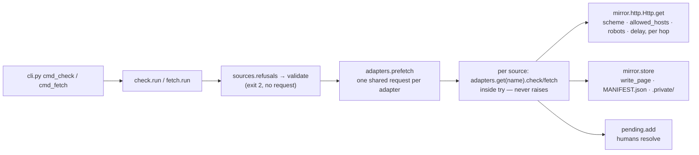

# Developer Guide

> Last updated: 2026-09-20

How to work on the `compliance-register` skill: get it running, test it, install it into Claude Code from a checkout, and extend it (adapters, subcommands) without breaking the design invariants. For what the tool does and why, see [Architecture](./ARCHITECTURE.md); for the design rationale, see the sibling design repo (below).

## Quick Start

```bash
git clone https://github.com/AlexSendula/compliance-register   # not yet published — use the local checkout for now
cd compliance-register
python3 -m pip install -r requirements-dev.txt                    # pytest + PyYAML
python3 -m pytest -q                                              # 307 passed, no network

# run the launcher against a scratch project: any directory with a knowledge-base/ inside it
mkdir -p /tmp/scratch/knowledge-base && cd /tmp/scratch
python3 /path/to/compliance-register/bin/compliance-register init      # "initialised knowledge-base/compliance"
python3 /path/to/compliance-register/bin/compliance-register status    # profile: 15 problem(s), not yet confirmed …
```

There is no install or build step. The launcher puts the repo directory on `sys.path` after resolving symlinks, so it imports the package from wherever the checkout lives (`bin/compliance-register:16-17`). Outside a project it exits 2 with `refused: no knowledge-base/ directory found …` (`compliance_register/cli.py:235-237`, `compliance_register/paths.py:26-31`).

## Prerequisites

| Need | Enforced where | Failure mode |
|---|---|---|
| Python >= 3.12 | `bin/compliance-register:9-14`, `pyproject.toml:4` | launcher prints the found version, exit 2 |
| PyYAML (the only runtime dependency) | `compliance_register/preflight.py:11-12`, `pyproject.toml:5` | launcher lists the pip command, exit 2 |
| A populated CA trust store | `compliance_register/preflight.py:13-15` | named before any https fetch would read "unreachable" |
| pytest (dev only) | `requirements-dev.txt:1-2` | — |

No environment variables, no database, no server. Nothing else to configure.

## Project Structure

```
compliance-register/
├── SKILL.md                     # the skill: stages, commands table, rules — read by the agent
├── README.md                    # install + the CLI list; tests keep it in sync with the parser
├── AGENTS.md                    # freya-devkit managed block (see below)
├── bin/compliance-register      # launcher: version gate, preflight, sys.path, then cli.main()
├── pyproject.toml               # metadata, requires-python, pytest config (pythonpath = ["."])
├── requirements-dev.txt
├── references/                  # method files the agent follows for stages 1–3, regime template, the one SPARQL query
├── compliance_register/         # the package
│   ├── cli.py                   # argparse + exit codes only; no logic
│   ├── paths.py                 # the only module allowed to decide a path; containment guards
│   ├── preflight.py             # prerequisite checks that must not raise
│   ├── render.py                # printable(): escape-at-sink, copied verbatim from docs-mirror — do not edit
│   ├── profile.py  regimes.py  sources.py  pending.py  status.py  search.py  frontmatter.py
│   ├── check.py  fetch.py  rescan.py   # the watch commands
│   └── mirror/
│       ├── http.py              # one client: allowed_hosts, robots.txt, per-host politeness, redirect per hop
│       ├── store.py             # markdown store, MANIFEST.json, licence gate (.private/)
│       ├── htmlmd.py            # html → markdown
│       └── adapters/            # __init__.py = registry + result contracts; eurlex, sitemap, feed, pagehash
├── tests/                       # pytest; conftest.py `project` fixture; fakehttp.py FakeOpener
├── .claude-plugin/              # plugin.json + marketplace.json for the Claude Code plugin route
└── knowledge-base/              # freya-devkit artifacts about THIS repo (reference/, .graph/, settings.json)
```

## Available Commands

| Command | Description |
|---|---|
| `python3 -m pytest -q` | Full suite from the repo root; `pyproject.toml:13-15` sets `testpaths` and `pythonpath` so no install is needed |
| `python3 -m pytest tests/test_check.py -q` | One file |
| `python3 bin/compliance-register --version` | Prints `compliance-register 0.1.0` (`compliance_register/__init__.py:1`) |
| `python3 bin/compliance-register <cmd>` | The CLI; full table in `SKILL.md` "Commands" |

There is no linter or formatter configured.

## Install the skill locally for Claude Code

Three routes; the first is the one for development because edits are live:

1. **Symlink the checkout into the skills directory.** `SKILL.md` sits at the repo root, and the launcher resolves symlinks before computing its own location (`bin/compliance-register:3-5, 16`), so the package imports from the real path.
   ```bash
   ln -s "$PWD" ~/.claude/skills/compliance-register
   ```
2. **Plugin marketplace from the local path.** `.claude-plugin/marketplace.json` declares one plugin with `source: "."` and `plugin.json` declares `skills: ["."]` (`.claude-plugin/marketplace.json:8`, `.claude-plugin/plugin.json:8`), so the repo is its own marketplace: `/plugin marketplace add /path/to/compliance-register`, then `/plugin install compliance-register@compliance-register`. The plugin cache holds a copy, so re-install after edits.
3. **Published form** (once on GitHub): `npx skills add AlexSendula/compliance-register` installs under `~/.agents/skills/<name>` (`README.md:12-14`, `bin/compliance-register:3-4`).

The agent runs the CLI by path — `python3 "$SKILL_DIR/bin/compliance-register" <command>` (`SKILL.md:41-49`) — never via an entry point, so nothing needs to be on `PATH`.

## The two-repo setup

| Repo | Holds | Rule |
|---|---|---|
| `compliance-register` (this one) | code, tests, `SKILL.md`, shipped `references/`, freya `knowledge-base/` | never a law fact: `tests/test_skill_md.py:128-137` fails on any CELEX, ISO date, `Art. N` or URL in `SKILL.md`, `README.md` or `references/*.md` |
| `compliance-devkit` (sibling, `../compliance-devkit`) | `design/workflow.md` (v0.2), `design/brainstorm-2026-09-17.md` (decisions D1–D29), `design/dimensions-checklist.md`, `design/plan-A-*` / `plan-B-*`, `research/` | the "why"; code comments cite decisions by number, e.g. D17 in `compliance_register/sources.py:3`, D19 in `compliance_register/check.py:3` |

When a decision changes, change it in the design repo first, then the skill. `references/dimensions-checklist.md` is the shipped copy of the design one; keep them in step by hand.

## Testing

- **No network, ever.** Every HTTP path is exercised through `tests/fakehttp.py` — `FakeOpener` maps URL → `(status, headers, body)`, a key ending in `*` is a prefix route (SPARQL query strings), and it records every request (`tests/fakehttp.py:8-26`). Inject it with `http.Http(user_agent="t", delay_seconds=0, sleep=lambda s: None, opener=FakeOpener({...}))` (`compliance_register/mirror/http.py:71-72`; example `tests/test_adapter_pagehash.py:19-24`). Always route `/robots.txt` too — the client asks for it before the first page on every host (`compliance_register/mirror/http.py:90-119`).
- **`project` fixture**: a `tmp_path` with an empty `knowledge-base/` (`tests/conftest.py:5-9`). CLI tests call `cli.main([...])` in-process after `chdir` (`tests/test_cli.py:8-18`); only `tests/test_launcher.py:8-12` spawns the real launcher.
- **Watch commands take a `client_factory`** (`compliance_register/check.py:37`, `compliance_register/fetch.py:17`) so a whole `check`/`fetch` run can be scripted without touching `default_client` (`compliance_register/fetch.py:10-14`).
- **Docs are tested.** The SKILL.md commands table and the README command list must name every parser command (`tests/test_skill_md.py:109-125`); `method-discover-sources.md` must name every agent-written `Source` field and enum value (`tests/test_skill_md.py:73-83`).

## How a watch command reaches an adapter



`sources.refusals` runs before any network call (`compliance_register/check.py:46-50`, `compliance_register/fetch.py:21-26`); `adapters.prefetch` runs once per run (`compliance_register/check.py:54`, `compliance_register/fetch.py:29`); the loop wraps each adapter call so one bad source becomes an `unreachable` result, never an abort (`compliance_register/check.py:56-59`, `compliance_register/fetch.py:37-40`).

## Adding an adapter

An adapter is one module in `compliance_register/mirror/adapters/` exposing two functions with a fixed shape (`compliance_register/mirror/adapters/__init__.py:1-2`). Copy `pagehash.py` — it is the smallest complete one.

1. **Contracts.** `check(source, client, *, today, cdir, **extra) -> CheckResult` and `fetch(source, client, cdir, *, today, force=False, **extra) -> FetchResult` (`compliance_register/mirror/adapters/pagehash.py:24, 44`). `CheckResult.status` is exactly one of `fresh | unreachable | moved`; `version` is the change signal, `changed` the affected URLs, `next_version`/`next_date` a scheduled future version (`compliance_register/mirror/adapters/__init__.py:14-21`). `FetchResult` carries `written` paths, a `skipped` count, `refused` reasons and the `version` that `fetch.run` records as `last_version` (`compliance_register/mirror/adapters/__init__.py:24-29`, `compliance_register/fetch.py:50-53`). "Could not tell" is always `unreachable`, never `fresh`.
2. **Register the name.** Append to `NAMES` and to the module tuple in `get()` — they are zipped positionally, so the order must match (`compliance_register/mirror/adapters/__init__.py:11, 32-35`). `sources.validate` refuses any adapter not in `NAMES` (`compliance_register/sources.py:14, 76-79`). If a tier should default to it, add it to `_DEFAULT_ADAPTER` (`compliance_register/sources.py:21`); if it needs `config` keys, validate them in `sources.validate` with a lazy import, the way eurlex does (`compliance_register/sources.py:94-100`).
3. **Go through the client and the store, only.** `client.get(url, allowed_hosts=source.allowed_hosts)` enforces scheme, host allow-list, robots.txt and the process-wide per-host delay on every hop (`compliance_register/mirror/http.py:27, 147-157`); XML listings pass `max_bytes=LISTING_MAX_BYTES` and go through `parse_xml`, which refuses a DTD (`compliance_register/mirror/adapters/__init__.py:10, 53-59`). Pages are written with `store.write_page`, which adds provenance frontmatter and routes non-redistributable sources under `mirror/.private/`; `load_manifest` / `save_manifest` / `needs_refresh` are the per-source state (`compliance_register/mirror/store.py:31, 54, 67, 81`). Never build a path yourself — `paths.contained` / `safe_component` are the guards (`compliance_register/paths.py:38-53`).
4. **Prefetch choke-point.** If N sources can share one request, extend `adapters.prefetch` (`compliance_register/mirror/adapters/__init__.py:38-50`). It returns `{adapter name: kwargs}`; `check.run` / `fetch.run` splat those kwargs into your `check()` / `fetch()` (`compliance_register/check.py:57`, `compliance_register/fetch.py:38`), so the signature must accept them — eurlex takes `resolved` (`compliance_register/mirror/adapters/eurlex.py:64-77, 87`). `prefetch` must never raise; a failure is stored per key and re-raised inside the adapter's own `try` (`compliance_register/mirror/adapters/eurlex.py:80-84`).
5. **The invariant.** Nothing law-specific ships: no instrument address, threshold or rule. An `api` adapter may carry only the endpoint of the protocol it speaks — the one address in the codebase is the CELLAR SPARQL endpoint (`compliance_register/mirror/adapters/eurlex.py:18`). Everything else is discovered into the project's `sources.json`.
6. **Tests and docs.** A `FakeOpener` test per status (fresh, moved, unreachable) plus a refused fetch; document any new `config` key in `references/method-discover-sources.md` and the tier/adapter in `SKILL.md` "The mirror".

## Adding a subcommand

`cli.py` is terminal I/O and exit codes only (`compliance_register/cli.py:1-2`).

1. Put the logic in its own module returning a plain report dict (the `check.run` shape with an `exit` key is the pattern, `compliance_register/check.py:40`). Raise the typed errors `main` already maps: `paths.NotAProject` / `paths.UnsafePath` → 2, `FrontmatterError` / `SourcesError` → 1 (`compliance_register/cli.py:233-243`).
2. Add `cmd_<name>(args) -> int` in `cli.py`. Every untrusted value that reaches stdout goes through `printable()` (`compliance_register/cli.py:12, 61`; `compliance_register/render.py:48`). Offer `--json` where a report exists; anything that writes a date takes `--today` via `_iso_date` (`compliance_register/cli.py:176-182`).
3. Register it in `build_parser` with `set_defaults(fn=cmd_<name>)` (`compliance_register/cli.py:185-221`). Exit codes: `0` done · `1` failure · `2` refused — argparse's own exit 2 is remapped to 1 (`compliance_register/cli.py:227-229`).
4. Add a row to the `SKILL.md` commands table and a line to the README list, or `tests/test_skill_md.py:109-125` fails. Test it through `cli.main` with the `project` fixture.

## Commit conventions

`type(scope): sentence` — see `git log --oneline -40`. Types in use: `feat`, `fix`, `docs`, `test`, `chore`. The scope is the module or file touched (`check`, `eurlex`, `http`, `skill`, `references`, `pytest`); several are comma-joined (`fix(check,fetch): …`). The sentence is lower-case, states the behaviour after the change, and has no trailing full stop:

```
fix(sitemap): cap fan-out at 2000 pages and 50 child sitemaps, reported in the check detail
feat(eurlex): resolve the whole basket once per run — prefetch() feeds check() and fetch()
docs(skill): pending kinds and severities; api adapters carry only their endpoint
```

Two-commit pattern (`AGENTS.md:12-13`): the code change is one commit; generated artifacts under `knowledge-base/` are a separate one. A release bumps the version in four places: `pyproject.toml:3`, `compliance_register/__init__.py:1`, `.claude-plugin/plugin.json:3`, `SKILL.md:20`.

## freya-devkit governs `knowledge-base/`

`AGENTS.md:1-30` is a block managed by `freya init` (edits inside it are overwritten). The `knowledge-base/` tree in this repo — `reference/*.md`, `.graph/`, `settings.json`, later `specs/`, `security/`, `BACKLOG.md` — is written by the `freya-*` skills, not by hand; `BACKLOG.md` in particular is a full overwrite. Run `/freya-devkit:freya-wrap-up` after a code change to refresh it.

Do not confuse the two uses of the directory name: in *this* repo `knowledge-base/` is freya's documentation about the skill; in a *target* project `knowledge-base/compliance/` is the skill's own data (`compliance_register/paths.py:12-13, 34-35`). The skill only requires `knowledge-base/` to exist, so both coexist in a project that uses freya too.

## Common Issues

| Symptom | Cause / fix |
|---|---|
| `compliance-register needs Python 3.12 or newer`, exit 2 | `bin/compliance-register:9-14`; run with a 3.12+ interpreter |
| `PyYAML is not installed`, exit 2 | `compliance_register/preflight.py:11-12`; `python3 -m pip install PyYAML` |
| `Python has no CA certificates`, exit 2 | python.org macOS build without certs (`compliance_register/preflight.py:13-15`); run `Install Certificates.command` or `pip install certifi` + `SSL_CERT_FILE` |
| `refused: no knowledge-base/ directory found …`, exit 2 | not inside a project; `mkdir knowledge-base` or use the `project` fixture in tests |
| a test sleeps for seconds | a real `Http` waits `delay_seconds` per host (`compliance_register/mirror/http.py:82-86`); pass `delay_seconds=0, sleep=lambda s: None` |
| `test_shipped_docs_carry_no_law_fact_or_source_address` fails | you put a URL, ISO date, CELEX or `Art. N` in `SKILL.md`, `README.md` or `references/` (`tests/test_skill_md.py:128-137`); files under `knowledge-base/` are not covered |
| `KeyError` from `adapters.get` | the adapter name is not in `NAMES`, or `NAMES` and the module tuple in `get()` are out of order (`compliance_register/mirror/adapters/__init__.py:11, 34`) |

## Related Documentation

- [Architecture](./ARCHITECTURE.md) — components and data flow
- `SKILL.md` — the agent-facing contract: stages, commands, rules
- `references/method-*.md` — what the agent does in stages 1–3
- `../compliance-devkit/design/` — workflow v0.2, decisions D1–D29, checklist (design repo)
