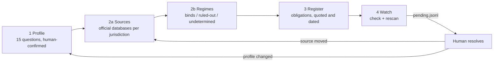

# Project Overview

> Last updated: 2026-09-22

## What is compliance-register?

A Claude Code skill that keeps a software project's applicable regulations — laws, regulator guidance, licences and contracts — locally available, dated, sourced and re-checked on command (`SKILL.md:3-8`). It is a consulting deliverable in the repo: for each regime it records what applies, why, what you must do and where the source says so. It never verifies that the code meets an obligation and never says "compliant"; that belongs to tests, BDD and other skills (`SKILL.md:97-98`, `references/method-register.md:31-32`).

The skill is a root `SKILL.md` with method files under `references/`, a `.claude-plugin/` manifest, and a Python CLI (`bin/compliance-register`) backed by the `compliance_register/` package. Runtime is Python 3.12+ and PyYAML only (`pyproject.toml:3-5`); the launcher refuses older interpreters and missing PyYAML with exit 2 and names what to install (`bin/compliance-register:9-14`, `bin/compliance-register:21-26`, `compliance_register/preflight.py:9-16`).

## Target Users

| User Type | Description | Key Needs |
|-----------|-------------|-----------|
| Developer using Claude Code | Works on a project with regulatory exposure (personal data, payments, consumer sales, AI features) | Ask "which rules apply to this feature?" and get an answer quoted from a dated source in the repo, not from the model's memory (`SKILL.md:10-15`, `SKILL.md:95-96`) |
| Product lead / owner | Decides what the project does about a detected change | A short pending list (`pending`) and a one-line way to record a decision (`resolve`) without editing register files by hand (`compliance_register/cli.py:52-75`) |
| The agent itself | Drives stages 1–3 from the method files | Deterministic helpers that validate, search, fetch and check, and never give a verdict (`SKILL.md:53-55`) |

## Core Features — the four stages

Stages 1–3 are agent-driven from the method files; stage 4 is two CLI commands (`SKILL.md:28-34`).

1. **Profile** — fifteen fixed dimension *questions*, never answers (`references/dimensions-checklist.md:3-6`). The slugs are the only law-independent artifact the skill ships (`compliance_register/profile.py:12-28`). Questions 1 and 2 (`establishment`, `directed_activity`) come first because they choose the jurisdictions (`references/method-profile.md:7-9`). The agent proposes a value with cited repo evidence; a human confirms; `profile validate` refuses every answer that is not a confirmed value — `unanswered`, still `proposed`, or confirmed as null — and a `confirmed_by`/`confirmed_at` written before all fifteen are confirmed (`compliance_register/profile.py:62-108`), so exit 0 means stage 1 is finished, not merely started; `rescan` gates on the narrower `profile.blocking` subset (`compliance_register/profile.py:111-117`).
2. **Discover** — *2a Sources*: web search per jurisdiction for the legislative database, gazette and implicated regulators, recorded in `sources.json` with tier, licence, robots posture and evidence (`references/method-discover-sources.md:23-65`). *2b Regimes*: read each candidate's scope clause, write one *applies* and one *exempt* question with verbatim quotes, and classify as `binds`, `ruled-out` (with reason) or `undetermined` (`references/method-discover-regimes.md:19-30`, `compliance_register/regimes.py:12`).
3. **Register** — per binding regime, `### <ID> · <title>` obligation blocks in condition form: When / You must / How often / It says / You'd know by / Note (`compliance_register/regimes.py:14`, `references/regime-template.md:43-49`). No quote, no obligation (`references/method-register.md:33`).
4. **Watch** — `check` asks each confirmed source's cheapest change signal and reports three-valued freshness per source (`compliance_register/check.py:1-3`, `compliance_register/sources.py:20`); `rescan` diffs confirmed profile answers against the last snapshot and raises `regime-new` / `regime-gone` (`compliance_register/rescan.py:51-70`). Both append to `pending.jsonl` and stop; `resolve` records what a human did in `resolutions.jsonl` (`compliance_register/pending.py:1-4`, `compliance_register/pending.py:87-96`).

Supporting commands: `init`, `status`, `pending`, `resolve`, `search` (BM25 over regimes, mirror and profile — `compliance_register/search.py:1-6`), `profile validate|diff`, `regimes validate`, `sources validate`, `fetch` (`compliance_register/cli.py:190-220`). Exit codes are 0 done, 1 failure, 2 refused (`compliance_register/cli.py:224-243`); `check` exits 1 when any source is unreachable (`compliance_register/check.py:78-79`) and 2 when there is nothing confirmed to check (`compliance_register/check.py:42-45`).

## Business Context

### Domain

Regulatory obligation registers for software products — the artifact a compliance consultant would leave behind, kept inside the repository so it ages with the code. The design repo (`compliance-devkit`, `design/workflow.md` §Invariants) frames it as "router, not oracle": the register routes a question to a dated, quoted source; it does not judge. Obligations may come from statute, regulator guidance, permits and licences held, contracts (a PSP's terms, a processor agreement, app-store terms), standards and court decisions (`references/dimensions-checklist.md:28-44`).

### Key Business Rules (design invariants)

| Rule | Description | Where enforced |
|------|-------------|----------------|
| Never says "compliant" | The register states obligations; `status` reports counts, never a verdict. Verification belongs to tests, BDD and other skills | `SKILL.md:97-98`, `compliance_register/status.py:1-2`, `references/regime-template.md:58` |
| Nothing law-specific ships | No rule, threshold, date or instrument address in the skill. The checklist holds questions only; sources are discovered into the project's `sources.json`. An `api` adapter may carry only its protocol endpoint | `references/dimensions-checklist.md:3-6`, `SKILL.md:126-129`, `compliance_register/mirror/adapters/eurlex.py:18` |
| Quoted, dated, cached, human-confirmed | Every source, regime and obligation carries a verbatim quote, a citation and a dated version; the agent never sets `status: confirmed` itself | `SKILL.md:99-102`, `compliance_register/regimes.py:75-77`, `compliance_register/sources.py:104-115` |
| Three-valued freshness | fresh / unreachable / moved; "could not reach" is never "fresh" or "not there" | `compliance_register/sources.py:20`, `compliance_register/mirror/adapters/__init__.py:14-21`, `SKILL.md:149-151` |
| Record, surface, delegate | `check` and `rescan` append to `pending.jsonl` and stop; only a human `resolve` moves anything. Both files are append-only and replayed | `compliance_register/pending.py:1-4`, `compliance_register/check.py:63-73`, `compliance_register/rescan.py:59-70` |
| Commands, not schedules | The CLI offers commands; when they run is the caller's decision. No cron, no daemon | `SKILL.md:34`, design repo `design/workflow.md` §Invariants |
| Code in the skill, data in the project | Everything written lands under `<root>/knowledge-base/compliance/`, committed; every write is checked against that base | `compliance_register/paths.py:1-6`, `compliance_register/paths.py:38-45`, `README.md:52-72` |
| Licence-gated mirror | Pages from a source with `redistribute: false` go to `mirror/.private/`, git-ignored by `init` and re-asserted on write | `compliance_register/mirror/store.py:18-24`, `compliance_register/mirror/store.py:34-39`, `compliance_register/cli.py:27-29` |
| robots.txt always honoured | Checked per host on every hop; no allowlist, no bypass. A disallowed source is recorded as `tier: refuse` and cited by URL | `compliance_register/mirror/http.py:90-119`, `compliance_register/mirror/http.py:156-157`, `SKILL.md:134-137` |
| Refuse loudly, never raise in the loop | One bad source never aborts the run; a guard or HTTP refusal becomes a `source-unreachable` entry and a non-zero exit | `compliance_register/check.py:56-59`, `compliance_register/fetch.py:37-48` |
| Escape at the sink | Every CLI print of source-derived text passes through `render.printable` (copied verbatim from docs-mirror) | `compliance_register/render.py:1-2`, `compliance_register/render.py:48`, `compliance_register/cli.py:61` |
| Path and host hygiene | Regime ids, source ids and jurisdictions are shape-checked before becoming paths; `allowed_hosts` refuses local and private addresses; https never downgrades to http; redirects are judged per hop | `compliance_register/paths.py:48-53`, `compliance_register/sources.py:88-93`, `compliance_register/mirror/http.py:147-176` |

### Integrations

| Service | Purpose | Notes |
|---------|---------|-------|
| EUR-Lex / CELLAR | The only `api`-tier adapter shipped, speaking CELLAR only (eur-lex.europa.eu's web front answers 202-empty to clients). One SPARQL resolve per run for the whole basket of CELEX numbers; the dated consolidated CELEX suffix is the change signal; `fetch` reads the act by content negotiation in the source's language, applies language-neutral content guards G1–G5 before writing and chunks it per article | `compliance_register/mirror/adapters/eurlex.py:1-4`, `compliance_register/mirror/adapters/eurlex.py:64-77`, `compliance_register/mirror/adapters/eurlex.py:184-196`, `compliance_register/mirror/adapters/eurlex.py:151`; query template `references/eurlex-resolve.sparql` |
| Generic web sources (sitemap / feed / page-hash tiers) | Any legislative database, gazette, regulator page or contract page a human confirms into `sources.json`. Tiers are tried in the order api → sitemap → feed → page-hash → refuse; `page-hash` must fetch to compare and says so | `compliance_register/sources.py:17-21`, `compliance_register/mirror/adapters/__init__.py:11`, `compliance_register/mirror/adapters/pagehash.py:1-2`, sitemap fan-out caps `compliance_register/mirror/adapters/sitemap.py:13-14` |
| freya-devkit (planned, read-only) | If present, may read the register — link a behaviour to an obligation, surface pending entries in `BACKLOG.md`. Nothing here gates a commit. The skill stays standalone and is not named `freya-*` | design repo `design/workflow.md` §Integration |
| docs-mirror | Design lineage only: the scraping engine, tiering, sink guard and BM25 search follow its design. No runtime coupling; unrelated stores | `compliance_register/render.py:1-2`, `compliance_register/search.py:3-6`, `compliance_register/mirror/http.py:1-5` |

There are no environment variables, no database, no HTTP server, no CI/CD and no hosting. Network is used only by `fetch` and `check` (`SKILL.md:17`); the test suite runs with none, through a scripted opener (`tests/fakehttp.py:1-3`).

## Project Status

- **Started:** design 2026-09-17 (design repo `design/brainstorm-2026-09-17.md`, decisions D1–D29); first code commit 2026-09-20
- **Current Version:** 0.1.0 (`compliance_register/__init__.py:1`, `.claude-plugin/plugin.json:3`)
- **Status:** pre-release, not yet published. Planned distribution: GitHub `AlexSendula/compliance-register`, then `npx skills add AlexSendula/compliance-register` and a listing on skills.sh; also installable as a Claude Code plugin from the repo's own marketplace (`README.md:12-21`, `.claude-plugin/marketplace.json:5-13`)
- **Tests:** 200 pytest tests, no network — `python3 -m pytest -q` from the repo root (`pyproject.toml:13-15`)
- **First trial target:** viva-croatia, a Dutch stichting community website (events, blog, tickets, donations) about to add Mollie payments. Not yet run
- **Known v1 limits:** EUR-Lex acts never consolidated are reported unreachable and cited by URL; EU language availability is not pre-checked; no browser-crawl tier (`SKILL.md:143-147`, design repo `design/workflow.md` §Open)

## Stakeholders

| Role | Name/Team | Contact |
|------|-----------|---------|
| Author and maintainer | Alex Sendula | GitHub `AlexSendula` (`.claude-plugin/plugin.json:5`, `SKILL.md:19`) |
| Licence | MIT for the tool; mirrored legal text keeps its source's licence | `LICENSE`, `README.md:85-88` |

## Related Documentation

- [Architecture](./ARCHITECTURE.md) — engine, adapters, store and data flow
- [Developer Guide](./DEVELOPER.md) — running the tests, adding an adapter
- `SKILL.md` — the skill contract: stages, commands, exit codes, rules
- `references/method-profile.md`, `references/method-discover-sources.md`, `references/method-discover-regimes.md`, `references/method-register.md` — the per-stage method the agent follows
- `references/dimensions-checklist.md` — the fifteen questions with provenance; `references/regime-template.md` — the register file shape
- Design repo `compliance-devkit`: `design/workflow.md` (v0.2), `design/brainstorm-2026-09-17.md` (D1–D29), `design/dimensions-checklist.md` — the "why" behind every invariant above
