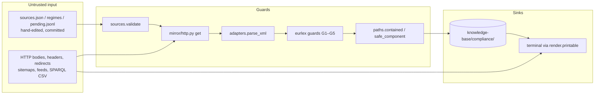

# Security

> Last updated: 2026-09-22

## Overview

`compliance-register` does two things an attacker can lean on: it fetches URLs that a human typed into `sources.json`, and it writes files into a git repository. Everything it prints was written by someone else — a regulator's web page, a sitemap, a SPARQL CSV, a hand-edited data file. The posture follows from that: **validate before the network, judge every hop, cap every read, never raise inside the loop, escape at the sink, and write only under one directory.**

There is no authentication, authorization, database, server, environment variable, credential or secret anywhere in the tool. The template sections for those do not apply and are omitted. Runtime is Python >= 3.12 plus PyYAML (`bin/compliance-register:9`, `compliance_register/preflight.py:11`).

## Trust boundaries

## Threat model

| Threat | Control | Where |
|---|---|---|
| SSRF to loopback / private / link-local addresses | `allowed_hosts` refused when `localhost` or an IP literal that is not globally routable; `url` must be `https`; and every hop is resolved before the request and refused if any answer is not globally routable (loopback, RFC 1918, link-local, CGNAT, IPv4-mapped, reserved, multicast) — `localtest.me` and `127.0.0.1.nip.io` are refused before a byte is sent | `compliance_register/sources.py:86-93`, `compliance_register/mirror/http.py:71-96`, `:200-226` |
| Redirect to another host, or to a private host, mid-chain | Every hop is re-checked: scheme must be `https` (plaintext `http` is refused even when a listing or `config.urls` names it), hostname must be in `allowed_hosts`, robots.txt re-consulted; `allowed_hosts` defaults to the source URL's host and a bare string is wrapped so it is never a substring test | `compliance_register/mirror/http.py:147-157`, `compliance_register/sources.py:57-61` |
| TLS downgrade via redirect | an `http://` Location is rewritten to `https://` before the hop; no request ever goes out in the clear (`test_http_redirect_is_upgraded_to_https_and_never_requested_in_the_clear`) | `compliance_register/mirror/http.py:249-251` |
| Redirect loop / hostile `Location` | `MAX_HOPS = 5`; control characters in `Location` refused; unparseable target refused (a refusal, not an `InvalidURL` traceback) | `compliance_register/mirror/http.py:19`, `:143-159` |
| Memory exhaustion from a huge body | Body read as `max_bytes + 1` and refused when over budget; client default 20 MB, listings (sitemap/feed) capped at 5 MB, robots.txt at 200 KB | `compliance_register/mirror/http.py:131-133`, `:72`, `:102`; `compliance_register/mirror/adapters/__init__.py:10` |
| Hanging connection | 30 s timeout per request | `compliance_register/mirror/http.py:71`, `:114` |
| Hammering a host / being throttled | Process-wide per-host politeness clock (default 10 s between requests, shared across clients); `429` and `5xx` retried twice with 2 s / 6 s backoff, then reported `unreachable` — never "no change" | `compliance_register/mirror/http.py:25-27`, `:82-86`, `:112-126` |
| Crawling where the site forbids it | robots.txt fetched once per host through the guarded hop loop (redirects followed, even to another public host — never a private one; 4xx = no rules, 5xx/unreachable = host unreachable, never fetched anyway), matched per RFC 9309 (longest pattern, allow on tie) and evaluated against both our product token and the request's User-Agent; no allowlist, no bypass switch (design repo, D24; RFC 9309) | `compliance_register/mirror/http.py:87-130`, `:160-189`; `tests/test_http.py:65` |
| Fan-out from one sitemap index | At most 50 child sitemaps and 2000 pages; the cap is reported in the result, not silently applied | `compliance_register/mirror/adapters/sitemap.py:13-14`, `:30-43` |
| XXE / entity expansion in a sitemap or feed | `<!DOCTYPE` in the first 4 KB or `<!ENTITY` anywhere is refused before `ET.fromstring` runs | `compliance_register/mirror/adapters/__init__.py:53-59` |
| SPARQL injection through `config.celex` | CELEX must match `\d{5}[A-Z]{1,2}\d{4}` at validation, before any request; only then is it interpolated into the query template | `compliance_register/sources.py:94-98`, `compliance_register/mirror/adapters/eurlex.py:24`, `:31-33` |
| Server-supplied CELEX used as a directory name or URL | Every SPARQL row is shape-checked (`_CONSOL`, `_ISO`) and malformed rows are dropped; the consolidated CELEX then becomes the path prefix and URL parameter | `compliance_register/mirror/adapters/eurlex.py:25-26`, `:46`, `:177`, `:204` |
| EUR-Lex returning 200 with site chrome instead of law | Guards G1–G5: HTML 200, documentation-tool marker, article anchors present, header matches requested CELEX/language/date, anchors unique and increasing | `compliance_register/mirror/adapters/eurlex.py:183-196` |
| Path traversal from a source id, jurisdiction, URL hash or CELEX | `safe_component` (ASCII, no leading dot, no separators) on jurisdiction and id; every write resolved and refused if outside the source's directory; page names are SHA-1 prefixes of the URL, never the URL | `compliance_register/paths.py:15`, `:38-53`; `compliance_register/mirror/store.py:18-24`, `:33`; `compliance_register/mirror/adapters/sitemap.py:50-51` |
| Writing outside the project | Root is the nearest ancestor with `knowledge-base/`; nothing is written elsewhere; not in a project is exit 2 | `compliance_register/paths.py:26-35`, `compliance_register/cli.py:235-240` |
| Terminal escape / bidi injection from mirrored text | Every CLI sink that prints text of foreign origin passes it through `render.printable`, which escapes every non-printable codepoint (Cc, Cf, Zl, Zp, surrogates, private-use); `--json` output uses `json.dumps` with ASCII escaping | `compliance_register/render.py:48-88`; `compliance_register/cli.py:61`, `:87`, `:146`, `:157`, `:236-242`; `compliance_register/status.py:67` |
| HTML written verbatim into `.md` | Conversion returns `None` (refused) on parser failure, empty output, or output that still looks like HTML; non-HTML responses are refused | `compliance_register/mirror/htmlmd.py:409-454`; `compliance_register/mirror/adapters/pagehash.py:16-21` |
| Poisoned data file bricking every command | A corrupt `pending.jsonl` line is skipped and counted; a regime with bad frontmatter is reported with `problems`; a non-dict manifest row is dropped; a bad `sources.json` is a typed error with exit 1 | `compliance_register/pending.py:22-45`; `compliance_register/regimes.py:99-104`; `compliance_register/mirror/store.py:54-64`; `compliance_register/sources.py:128-141`; `tests/test_poisoned_files_do_not_brick.py` |
| One bad source aborting the run | Adapter `check`/`fetch` wrapped in a broad `except`; result becomes `unreachable`/`refused`; manifest saved in `finally` | `compliance_register/check.py:56-59`, `compliance_register/fetch.py:37-40`, `compliance_register/mirror/adapters/sitemap.py:90-93` |
| Unsafe YAML deserialisation | `yaml.safe_load` / `yaml.safe_dump` only; non-mapping frontmatter refused | `compliance_register/frontmatter.py:33-37`, `:60` |
| Argument injection into `git show` | `--end-of-options` before the user-supplied ref | `compliance_register/cli.py:107` |
| Fetching what a human has not confirmed | A source named on the command line must have `status: confirmed`; `tier: refuse` is never fetched; validation runs before any network request | `compliance_register/sources.py:104-115`, `compliance_register/check.py:46-50`, `compliance_register/fetch.py:21-36` |
| Torn writes on interrupt | `sources.json`, `MANIFEST.json` and every markdown page are written to a temp file then `os.replace`d | `compliance_register/sources.py:144-155`, `compliance_register/mirror/store.py:67-78`, `compliance_register/frontmatter.py:64-73` |

## Data protection

### What is written, and where

Only under `<project>/knowledge-base/compliance/` (`compliance_register/paths.py:1-6`). Mirrored pages carry provenance frontmatter — source id, URL, retrieval date, content hash, licence, attribution (`compliance_register/mirror/store.py:40-49`) — so a reader can always tell where a passage came from and when.

### Licence gating

A source whose `licence.redistribute` is not `true` is written under `mirror/.private/` (`compliance_register/mirror/store.py:18-24`; the `redistributable` property is `compliance_register/sources.py:67-69`). `init` writes `mirror/.gitignore` with `.private/` (`compliance_register/cli.py:27-29`), and every private write re-checks that line exists so a clone where `init` never ran cannot commit it on the next `git add -A` (`compliance_register/mirror/store.py:34-39`). `licence.redistribute` must be an explicit boolean or validation fails (`compliance_register/sources.py:84-85`).

### Append-only history

`pending.jsonl` and `resolutions.jsonl` are only ever appended; state is derived by replay so a human can read either file top to bottom (`compliance_register/pending.py:1-4`, `:52-55`). Resolving an already-resolved id is refused (`compliance_register/pending.py:92-93`).

### Disclosure to the sites fetched

The default User-Agent names the tool, version, repository and a contact address (`compliance_register/mirror/http.py:29-30`). No cookies, no credentials, no headers beyond `User-Agent` and `Accept` are sent (`compliance_register/mirror/http.py:110`).

## Dependency security

One runtime dependency, PyYAML, used only through its safe API. TLS verification is urllib's default against the system CA store; the launcher refuses to start when that store is empty rather than fail later with a confusing error (`compliance_register/preflight.py:13-15`). `htmlmd.py` and `render.py` are verbatim copies from docs-mirror and should be diffed against upstream before editing (`compliance_register/mirror/htmlmd.py:51-52`, `compliance_register/render.py:1-2`).

## Known limitations

- **Resolve-then-connect window (TTL-0 rebinding).** Every hop is resolved and vetted (`compliance_register/mirror/http.py:200-226`), but urllib resolves again to connect; a name answering public then private between the two lookups reaches the private address at the TCP/TLS level. Not practically exploitable: the client is https-only with certificate verification, so the private target must present a certificate valid for the confirmed name before any HTTP is sent. Pinning the connection to the vetted address would close it.
- **Proxy environments are out of scope.** urllib honours `https_proxy`; the resolution check assumes direct DNS and direct connections. Behind a mandatory proxy the tool reports names it cannot resolve locally as unreachable.
- **Per-source User-Agent policy.** `headers.user_agent` may select `neutral` (curl) or `browser` (Firefox) strings (`compliance_register/mirror/http.py:29-33`); robots.txt is evaluated against that string *and* against our own product token, so a site that names `compliance-register` is honoured under every policy. The default discloses; a human choosing otherwise is on record in `sources.json`. Note that `browser` is not a way through a bot wall: a CDN that fingerprints TLS and header order reads it as a claim this client cannot back up, and challenges it where it admits the self-identified default (TROUBLESHOOTING, "HTTP 403").
- **Mirrored text is data an agent will read.** Nothing in the tool stops an agent from following instructions embedded in a fetched page. `printable` protects the terminal, not the reader.
- **Redirect budget is per `get`, not per run.** A listing with thousands of redirecting entries costs a request each, bounded only by the page caps and the politeness clock.
- **`profile diff` prints git's stderr unescaped** (`compliance_register/cli.py:120`); the input is the local user's own ref, not remote content.
- **No integrity check on the mirror.** Content hashes are recorded for change detection (`compliance_register/mirror/store.py:27-28`), not signed; the git history of the target project is the audit trail.
- **Compliance is never verified.** The tool records what applies and where it says so. It has no opinion on whether a project meets an obligation.

## Reporting

Report security issues as GitHub issues on `AlexSendula/compliance-register`. The project is pre-release (0.1.0) and unpublished; there is no private disclosure channel yet.

## Related documentation

- [Architecture](./ARCHITECTURE.md) — module map and data flow
- [Testing](./TESTING.md) — the no-network `FakeOpener` the guard tests run against
- Design repo (`compliance-devkit`, `design/brainstorm-2026-09-17.md`) — D19 record-surface-delegate, D20 data lives in the project, D24 robots.txt without allowlist
