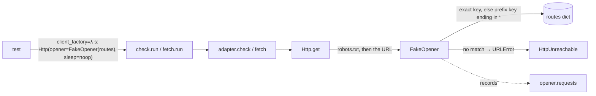

# Testing Guide

> Last updated: 2026-09-22

## Overview

The suite is **315 pytest tests, no network, no DNS, under a second** (`python3 -m pytest -q` → `315 passed in 0.8s`). Every HTTP call goes through an injected opener, every clock through an injected `today`, every sleep through an injected callable, and every project through a `tmp_path`. Nothing in `tests/` reaches the internet, reads the real date, or touches a real project.

Two things are deliberately outside the suite: live endpoints (EUR-Lex CELLAR, regulator sitemaps, real `robots.txt`) and the agent-driven Discover stage. Both are covered by the supervised first trial on viva-croatia, not by pytest — see "What is not tested".

## Testing Stack

| Tool | Purpose | Where |
|------|---------|-------|
| pytest 9 | Runner; `testpaths=["tests"]`, `pythonpath=["."]` so `from tests.fakehttp import …` resolves from the repo root | `pyproject.toml:13-15` |
| PyYAML | The only runtime dependency; also used by `test_skill_md.py` to parse SKILL.md frontmatter | `requirements-dev.txt`, `tests/test_skill_md.py:5` |
| `tests/fakehttp.py` | Scripted HTTP opener, the one test double the suite needs | `tests/fakehttp.py:8-26` |
| `pytest.monkeypatch` | Adapter/ssl/subprocess faults where an opener route cannot express them | `tests/test_check.py:56-71`, `tests/test_preflight.py:14-19` |

No coverage tool is configured and no CI runs the suite; it is run by hand before a commit.

## Running Tests

```bash
cd /path/to/compliance-register          # pyproject.toml sets the path
python3 -m pytest -q                      # all 200
python3 -m pytest -q tests/test_check.py  # one module
python3 -m pytest -q -k robots            # by name substring
python3 -m pytest -q -x --lf              # stop at first failure, re-run last failures
```

Requirements: Python ≥ 3.12 and `pip install -r requirements-dev.txt` (pytest + PyYAML). `pip install -e .` is not required.

## Test Organization

One `tests/test_<module>.py` per production module, plus four cross-cutting files.

```
tests/
├── conftest.py                         # `project` fixture: tmp_path + knowledge-base/
├── fakehttp.py                         # FakeOpener — routes dict, records requests
├── fixtures/                           # real markup, read by the adapter and htmlmd tests
│   ├── eurlex-consolidated.html        #   real EUR-Lex consolidated page, 3 articles, 516 lines
│   ├── eurlex-chrome.html              #   EUR-Lex site chrome / "document does not exist" page
│   ├── sitemap.xml                     #   3 <url> rows, mixed lastmod formats
│   ├── feed.xml                        #   RSS 2.0, 2 items
│   └── sparql-resolve.csv              #   CELLAR CSV: 4 consolidation rows across 2 CELEX
├── test_<module>.py                    # per module (see table)
├── test_poisoned_files_do_not_brick.py # cross-cutting: corrupt data never denies a command
├── test_skill_md.py                    # cross-cutting: SKILL.md / references / plugin.json conform
├── test_launcher.py                    # bin/compliance-register via subprocess
└── test_preflight.py                   # empty CA trust store is named, not silent
```

| File | Tests | Exercises |
|------|-------|-----------|
| `test_http.py` | 53 | redirects per hop, budget, retries, robots per RFC 9309, politeness clock, hostile `Location`, per-hop resolution (SEC-003) |
| `test_cli.py` | 26 | every subcommand in-process; exit codes; messages; escape-at-sink on `search`, `pending` and `resolve` output |
| `test_adapter_eurlex.py` | 23 | SPARQL resolve, CELLAR content negotiation, guards G1–G5, per-article chunking, basket chunking, skip on unchanged version |
| `test_htmlmd.py` | 23 | HTML→markdown on real EUR-Lex markup (carried over from docs-mirror) |
| `test_sources.py` | 21 | `sources.json` schema, validation, `Source` round-trip |
| `test_check.py` | 17 | three-valued freshness, `affects`, dedup of open pending entries, `--today`, refuse-tier exclusion |
| `test_skill_md.py` | 16 | Agent Skills spec conformance; no law fact or source address in shipped docs; version identical in four places; references consistency |
| `test_paths.py` | 14 | project detection, containment incl. symlinks, `safe_component` limits |
| `test_adapter_sitemap.py` | 12 | sitemap tier with `include` prefixes, caps, no page bodies on check, `--force`, HTML-listing message |
| `test_store.py` | 12 | public vs `.private/` store, provenance frontmatter, manifest, unsafe ids |
| `test_profile.py` | 10 | 15-dimension profile, validate rules, diff |
| `test_rescan.py` | 9 | snapshot + drift → pending, refusals |
| `test_search.py` | 9 | BM25, tokenizer, `--kind`, index rebuild |
| `test_fetch.py` | 8 | fetch command: refusals, `--force`, refuse tier |
| `test_frontmatter.py` | 8 | YAML block edge cases, atomic save, dates |
| `test_regimes.py` | 8 | regime frontmatter and obligation rules |
| `test_adapter_feed.py` | 7 | RSS and Atom, guid fallback, non-HTML entries, empty listing |
| `test_pending.py` | 6 | append-only logs, ids, resolve errors |
| `test_poisoned_files_do_not_brick.py` | 6 | see below |
| `test_adapter_pagehash.py` | 5 | page-hash tier: `.private/`, unreachable, not-html, url fallback |
| `test_launcher.py` | 5 | launcher: version, executable bit, cannot-start listing, old-Python guard |
| `test_status.py` | 5 | counts, age, unreadable lines, corrupt profile |
| `test_preflight.py` | 2 | prerequisites: CA store, PyYAML |
| `test_render.py` | 2 | `printable` identity and mnemonics |

## The no-network rule

**No DNS either.** `tests/conftest.py` stubs `mirror.http.resolve` for every test to answer a public address, so the SEC-003 per-hop resolution check never touches a resolver; a test that wants a private answer passes `Http(resolver=…)`, and the one test that resolves a real name uses `localhost` (no network) after `monkeypatch.undo()`.

`Http.__init__` takes `opener` and `sleep` as keyword arguments and defaults them to `urllib` and `time.sleep` (`compliance_register/mirror/http.py:71-78`). `check.run` and `fetch.run` take a `client_factory` that defaults to a real client built from the source's headers and delay (`compliance_register/check.py:37`, `compliance_register/fetch.py:10-17`). Tests replace both seams; nothing else is patched for HTTP.



**FakeOpener** (`tests/fakehttp.py:8-26`) maps a URL to `(status, headers, body)` or to a callable receiving the `Request`. A key ending in `*` matches any URL with that prefix — needed because EUR-Lex SPARQL requests carry the whole query in the URL (`tests/test_adapter_eurlex.py:36`). An unrouted URL raises `URLError`, which the client turns into `HttpUnreachable` after its retries, so a forgotten route surfaces as "unreachable", never as a hang. Every request is appended to `opener.requests`, which tests use to assert *no* request was made before validation refused (`tests/test_check.py:74-81`) or that a basket of EUR-Lex sources issued exactly one SPARQL query (`tests/test_adapter_eurlex.py:160-169`).

**Robots is always routed.** The client fetches `/robots.txt` before the first URL on a host, so every route table carries `"https://host/robots.txt": (404, {}, "")` or an explicit `Disallow` (`tests/test_http.py:56-63`). There is no bypass flag, and a test asserts the constructor has none (`tests/test_http.py:65-67`).

**The politeness clock is process-wide** (`compliance_register/mirror/http.py:27`). Tests that measure it inject `sleep=slept.append` and call `http._LAST_BY_HOST.clear()` first (`tests/test_http.py:114-125`); every other test passes `delay_seconds=0` and `sleep=lambda s: None`.

## Patterns

**Throwaway project.** The `project` fixture is `tmp_path` with an empty `knowledge-base/` (`tests/conftest.py:5-9`). Tests either call `paths.compliance_dir(project); cdir.mkdir()` and write files directly, or run `init` through the CLI harness.

**In-process CLI.** `tests/test_cli.py:8-18` calls `cli.main(args)` with stdout/stderr redirected and the cwd switched to the project, returning `(code, out, err)`. This is how exit codes 0/1/2 and escape-at-sink are asserted without a subprocess. Only `tests/test_launcher.py:8-12` spawns `bin/compliance-register` as a real process, to prove the launcher is executable and prints its version.

**`--today` injection.** Every command that writes a date takes `today` as a keyword (`compliance_register/check.py:37`, `compliance_register/fetch.py:17`, `compliance_register/rescan.py:31`); the CLI parses `--today` as ISO-only and falls back to the real date (`compliance_register/cli.py:171-182`). Tests pin `today="2026-09-20"` and step it a day to prove an open pending entry is not duplicated on the next run (`tests/test_check.py:93-98`).

**Shared builders, imported across files.** `META`/`write` build a regime file (`tests/test_regimes.py:5-17`), `EURLEX` a full source dict (`tests/test_sources.py:7`), `confirmed_profile()` a profile with all 15 dimensions answered (`tests/test_rescan.py:7-12`), and `setup()` a project with one confirmed sitemap source plus its client factory (`tests/test_check.py:12-24`). Cross-cutting tests import these rather than redefining them.

**Faults an opener cannot script** go through `monkeypatch`: an adapter that raises must be reported as `unreachable` for that source while the run continues and `.last-check` is still written (`tests/test_check.py:56-71`); an empty CA store must be named with `SSL_CERT_FILE` in the message (`tests/test_preflight.py:14-19`); `profile diff --against` must never let a ref become a git option (`tests/test_cli.py:126-135`).

**Poisoned files.** `tests/test_poisoned_files_do_not_brick.py` writes a non-JSON line into `pending.jsonl`, unterminated YAML into a regime, junk rows into a MANIFEST, and `{not json` into `sources.json`, then asserts the honest rest is still listed and the damage is counted (`status` reports `unreadable`) or typed (`SourcesError` → exit 1). The docstring names the docs-mirror shape it follows: skip and report, never raise at the row.

**Spec conformance as tests.** `tests/test_skill_md.py` checks the SKILL.md frontmatter against the Agent Skills spec, that the commands table covers every parser subcommand (walked from `build_parser()`, lines 93-114), that `pending.KINDS`/`SEVERITIES` are all documented, and that no shipped doc contains a CELEX, ISO date, `Art. N` or URL (`tests/test_skill_md.py:128-137`) — the "nothing law-specific ships" invariant as a regex.

## Fixtures

The four adapter fixtures are real or real-shaped, never hand-simplified. `eurlex-consolidated.html` is a genuine EUR-Lex consolidated page (title `Consolidated TEXT: 32011L0083 — EN — 28.05.2022`, three articles); tests chunk it per article and prove G4 needs the `<p class="reference">` line, not the `<title>` (`tests/test_adapter_eurlex.py:96-100, 172-183`). `eurlex-chrome.html` is the login/nav shell EUR-Lex serves when a document is missing; fetch must refuse it under G2/G3 with nothing written. `sparql-resolve.csv` carries a future-dated consolidation so `resolve` can be shown to pick `current` vs `next` client-side by `today` (`tests/test_adapter_eurlex.py:57-60`). Malformed CSV variants are built inline, not as files.

## Conventions

1. A test asserts the **report dict and the files on disk**, not just a return value: `rep["exit"]`, `sources.load(cdir)[0].last_status`, `pending.list_open(cdir)`, `.last-check`.
2. Failure paths are first-class: for every "works" test there is a "refused" or "unreachable" sibling, and the refusal must be a value, not a traceback.
3. A route table contains only what the test needs; the missing route *is* the unreachable case.
4. Terminal-control bytes (`\x1b`, U+202E) appear in test data whenever a command prints user-controlled text (`tests/test_cli.py:88-105`).
5. Never assert a verdict on the project — the tool records obligations, it does not verify them; `tests/test_skill_md.py:27-29` fails if SKILL.md phrases a verdict.

## What is not tested

- **Live network.** No test reaches EUR-Lex, CELLAR, a regulator site or a real `robots.txt`; `SKILL.md:17` states network is needed only for `fetch` and `check`. The supervised trial on viva-croatia is where the real endpoints, real politeness delays and real licence pages get exercised.
- **The Discover stage.** Source and regime discovery is agent web search guided by `references/method-*.md`; the code only stores and validates what the agent proposes. Tests cover the storage and validation, not the search.
- **Wall-clock behaviour.** `sleep` is always injected and every date-writing call pins `today`; the `_today()` fallback (`compliance_register/cli.py:171-173`) and the real backoff timings (`compliance_register/mirror/http.py:20-21`) are never asserted against.
- **Coverage numbers.** None are collected.

## Related Documentation

- `SKILL.md` — command table and exit-code rules the CLI tests assert against
- `README.md` — engine files (`.last-check`, `MANIFEST.json`, `mirror/.private/`) that tests create
- `knowledge-base/principles.md` — the invariants the cross-cutting tests encode
- Design history: the compliance-devkit repo (`design/workflow.md`, `design/brainstorm-2026-09-17.md`) — why refusal is three-valued and why robots has no bypass
