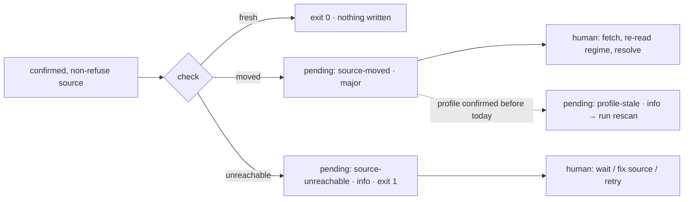

# Troubleshooting Guide

> Last updated: 2026-09-21

Every message below is quoted from the code as it prints. Read the exit code first: `0` done · `1` failure (bad input, a validator found problems, a guard or HTTP refused something during `fetch`, an unreachable source during `check`) · `2` refused (the tool did not start, or made no request on purpose). The mapping lives in `compliance_register/cli.py:224-243` and `bin/compliance-register:9-26`. Everything untrusted that reaches the terminal passes through `printable()` (`compliance_register/render.py:48`), so a message showing `\x1b` or `‮` is a source that tried to repaint your terminal, not a display bug.

## Start-up (exit 2, nothing ran)

| Message (stderr) | Cause | Fix |
|---|---|---|
| `compliance-register needs Python 3.12 or newer (found 3.11).` | Launcher version gate (`bin/compliance-register:9-14`) | Run with a 3.12+ interpreter: `python3.12 bin/compliance-register …` |
| `compliance-register cannot start:` / `  - PyYAML is not installed. Install it with: python3 -m pip install PyYAML` | Preflight (`compliance_register/preflight.py:11-12`) | Install PyYAML into the same interpreter that runs the launcher |
| `  - Python has no CA certificates — https fetches will fail. On a python.org macOS install run /Applications/Python 3.x/Install Certificates.command, or pip install certifi and set SSL_CERT_FILE` | `ssl.create_default_context()` has zero CA roots (`compliance_register/preflight.py:13-15`); python.org macOS builds ship without a system trust link | Run `/Applications/Python 3.12/Install Certificates.command` (substitute your minor version), or `pip install certifi` and export `SSL_CERT_FILE=$(python3 -m certifi)` |
| `refused: no knowledge-base/ directory found from /path upward — run this inside a project that has a knowledge-base/ directory` | `paths.find_root` walks up from cwd looking for `knowledge-base/` (`compliance_register/paths.py:26-31`; message at `compliance_register/cli.py:235-237`) | `cd` into the project, or `mkdir knowledge-base` at its root, then `compliance-register init` |
| `refused: unsafe name: '…'` or `refused: … resolves outside …` | A jurisdiction, source id or relpath fails the one-segment rule `^[A-Za-z0-9][A-Za-z0-9._-]{0,127}$` or escapes `knowledge-base/compliance/` (`compliance_register/paths.py:38-53`; printed at `compliance_register/cli.py:238-240`) | Fix the id in `sources.json` / the regime frontmatter; the tool will not write the path |

Preflight lists every problem it finds in one run (`bin/compliance-register:21-26`), so fix all lines before retrying. The CA check only matters for `fetch` and `check`; every other command works without certificates but the launcher still refuses, by design.

`knowledge-base/` present but `knowledge-base/compliance/` missing is **not** an error: `status` prints `profile: none — run the profile stage first` (`compliance_register/status.py:51`) and `check` exits 2 with `nothing to check — no confirmed sources`. Run `init` — it is idempotent and never overwrites an existing file (`compliance_register/cli.py:22-40`).

## Usage errors (exit 1)

- A bad flag or missing argument prints argparse's own usage to stderr; the tool remaps argparse's exit 2 to **1** because bad input is a failure, not a refusal (`compliance_register/cli.py:227-229`). `--help` still exits 0.
- No subcommand: help on stderr, exit 1 (`compliance_register/cli.py:230-232`).
- `--today 2026-13-40` → `error: argument --today: '2026-13-40' is not a date (YYYY-MM-DD)` (`compliance_register/cli.py:176-182`). `--today` is written verbatim into `sources.json`, `.last-check` and pending rows and compared as a string, hence the strict shape.
- `error: sources.json: invalid JSON: …`, `error: sources.json: must be an object with a 'sources' list`, `error: sources.json: malformed source entry: …` — `sources.json` cannot be read at all (`compliance_register/sources.py:128-141`; printed at `compliance_register/cli.py:241-243`). Fix the JSON; validation problems inside a readable file are a different path (below).
- `error: frontmatter block is not terminated`, `error: invalid YAML in frontmatter: …`, `error: frontmatter must be a mapping` — `profile.md` is unparseable (`compliance_register/frontmatter.py:19-37`). Regime files with the same fault do **not** abort the run; they surface as `problem: <file>: unreadable: …` (`compliance_register/regimes.py:100-105`).
- `resolve`: `unknown pending id: chg-0003` (id not in `pending.jsonl`) or `chg-0003 is already resolved` (`compliance_register/cli.py:65-75`, `compliance_register/pending.py:87-96`). Resolutions are append-only; there is no undo, record a new decision with `--note` instead.
- `profile diff --against HEAD~1`: git's own stderr is passed through (`fatal: bad revision …`) (`compliance_register/cli.py:117-121`). The ref must contain `knowledge-base/compliance/profile.md`; a file path works too.

## Validation failures (exit 1 for the validators, exit 2 for `check`/`fetch`)

`check` and `fetch` run `sources.validate` on every chosen source **before any request** and exit 2 if anything fails (`compliance_register/check.py:46-50`, `compliance_register/fetch.py:21-26`, via `sources.refusals` at `compliance_register/sources.py:104-115`). Run `compliance-register sources validate` to see the same list with exit 1.

| Message (`<id>: …`) | Meaning | Source |
|---|---|---|
| `tier must be one of ('api', 'sitemap', 'feed', 'page-hash', 'refuse')` | typo in `tier` | `compliance_register/sources.py:74-75` |
| `api tier needs an explicit adapter (eurlex)` | `api` has no default adapter; the other tiers do | `compliance_register/sources.py:76-77`, defaults at `:21` |
| `unknown adapter 'x'; must be one of ('eurlex', 'sitemap', 'feed', 'pagehash')` | adapter name not in the registry | `compliance_register/sources.py:78-79`, registry `compliance_register/mirror/adapters/__init__.py:11` |
| `url must be https` | http sources are never fetched | `compliance_register/sources.py:86-87` |
| `allowed_hosts must not include local or private addresses (127.0.0.1)` | loopback, private, link-local or `localhost` | `compliance_register/sources.py:92-93`, `:118-125` |
| `licence.redistribute must be true or false` | the field decides `mirror/` vs `mirror/.private/`; it must be a real boolean | `compliance_register/sources.py:84-85`, store at `compliance_register/mirror/store.py:18-24` |
| `config.celex must be a base CELEX number (e.g. 32016R0679)` / `config.language must be one of […]` | eurlex adapter shape checks | `compliance_register/sources.py:94-100` |
| `required confirmation missing (status proposed)` | you named it with `--source` but no human set `status: confirmed` | `compliance_register/sources.py:111-112` |

`profile validate` (`compliance_register/profile.py:53-77`): `<slug>: missing`, `<slug>: unanswered`, `<slug>: status must be one of ('unanswered', 'proposed', 'confirmed')`, `<slug>: confirmed but value is null`, `<extra>: not a known dimension`, and once all fifteen are confirmed, `confirmed_by is required …` / `confirmed_at is required …`. The 15 slugs are fixed at `compliance_register/profile.py:12-28`; `rescan` refuses (exit 2, `profile does not validate: …`) until this list is empty (`compliance_register/rescan.py:35-37`).

`regimes validate` (`compliance_register/regimes.py:59-91`): `<key>: required` for any of `id, title, status, jurisdiction, sources, confirmed_by, confirmed_at`; `status: must be one of ('binds', 'ruled-out', 'undetermined', 'no-longer-applies')`; `sources: must be a list of {id, version, retrieved}`; `applies: quote and cite are required when status is binds`; `exempt.reason: required when status is ruled-out`; `obligations: a ruled-out regime must not list obligations`; `obligations: duplicate id X`; `<obl>: unknown field 'Y'` (only `When, You must, How often, It says, You'd know by, Note` are allowed, `compliance_register/regimes.py:14`); `filename x.md does not match id y` (`compliance_register/regimes.py:109-110`). `status` repeats them as `problem:` lines (`compliance_register/status.py:43`, `:66-67`).

## `check` — the three answers and what each asks of you

Output shape: `fresh N · moved N · unreachable N`, one detail line per source, then `see: compliance-register pending` if anything moved or was unreachable (`compliance_register/cli.py:155-159`). `.last-check` is rewritten on every completed run (`compliance_register/check.py:82`), so `status` → `last check: never` means no `check` has finished since `init`.

**`moved`** — the change signal differs from what is recorded. Exit stays 0: the drift is *known*. One `source-moved` (major) row per `(source, to-version)` (`compliance_register/check.py:63-67`); the detail says what moved:
- eurlex: `consolidation 02016R0679-20160504 → 02016R0679-20240101` (`compliance_register/mirror/adapters/eurlex.py:98-99`)
- sitemap: `3 of 120 pages have a newer lastmod` (`compliance_register/mirror/adapters/sitemap.py:62-63`)
- feed: `2 new feed entries` (`compliance_register/mirror/adapters/feed.py:37-39`)
- page-hash: `page-hash tier fetches to compare: 1 of 1 changed` — this tier must download to know, and says so (`compliance_register/mirror/adapters/pagehash.py:37-41`)

What to do: `fetch --source <id>` (only `fetch` advances `last_version`, `compliance_register/fetch.py:50-53`; `check` never does), re-read the affected regime files named in `affects`, then `resolve <id> --action applied|dismissed|deferred --by <you>`.

**`unreachable`** — we could not tell. Exit **1** (`compliance_register/check.py:78-79`) because "could not reach" is never "not there". One `source-unreachable` (info) row per source, deduped while one is open (`compliance_register/check.py:68-70`). The detail is the reason:

| Detail | Meaning | Do |
|---|---|---|
| `https://…: HTTP 503` / `HTTP 429` | server error or rate-limit, after 2 retries with 2 s and 6 s back-off (`compliance_register/mirror/http.py:20-21`, `:115-126`) | retry later; raise `delay_seconds` in `sources.json` if 429 repeats |
| `https://…: <host> resolves to a private or local address (…)` | the confirmed name resolves to loopback, RFC 1918, link-local, CGNAT or another non-routable range (`compliance_register/mirror/http.py:200-226`) | do not add it to `allowed_hosts`; this is SEC-003 doing its job — confirm the source's real public host |
| `https://…: cannot resolve <host>: …` | DNS failed after the retries, or the name is not valid IDNA (`compliance_register/mirror/http.py:200-226`) | check the spelling and your resolver; behind a mandatory proxy the tool cannot resolve at all (out of scope) |
| `https://…: <urlopen error …>` / `timed out` | network / DNS / TLS (`compliance_register/mirror/http.py:122-123`) | check connectivity; a TLS error on macOS is the empty CA store above |
| `https://…: disallowed by robots.txt` | the host forbids this path for our product token or the user agent sent (`compliance_register/mirror/http.py:156-157`) | see robots.txt below — do not bypass |
| `robots.txt unreadable, rules unknown: …` | robots.txt answered 5xx, redirected somewhere we may not follow, or could not be reached — the rules are unknown, so nothing on that host is fetched this run (`compliance_register/mirror/http.py:173-181`) | retry later; it counts as unreachable, not as a move |
| `https://…: host X not in allowed_hosts […]` | the page or a redirect hop left the allow-list (`compliance_register/mirror/http.py:154-155`) | add the host to `allowed_hosts` only if the redirect is legitimate |
| `more than 5 redirects` / `redirect without Location` | redirect judged per hop and refused; an `http://` target is upgraded to https instead of refused (`compliance_register/mirror/http.py:143-159`) | the source's address is wrong or the site is broken; find the new canonical URL |
| `https://…: body exceeds 20000000 bytes` | over budget (`compliance_register/mirror/http.py:131-133`; listings are capped at 5 MB, `compliance_register/mirror/adapters/__init__.py:10`) | narrow the source (`config.include` for sitemaps) |
| `listing is an HTML page, not XML (a bot challenge or error page served as 200?)` | the host answered the sitemap/feed URL with HTML — usually a WAF challenge; page-hash the pages you need instead, or retry later (`compliance_register/mirror/adapters/__init__.py:53-62`) | |
| `DTD in XML listing` | a sitemap or feed carrying a DOCTYPE or entity declaration is refused before parsing (`compliance_register/mirror/adapters/__init__.py:53-62`) | the listing is not one we will read; pick another tier |
| `https://…: not html` | page-hash tier got a 200 that does not open as an HTML document (`compliance_register/mirror/adapters/pagehash.py:19-20`, `:34`) | the URL serves a PDF/JSON/redirect page; fix the URL or the tier |
| `SPARQL HTTP 503` / `SPARQL returned no rows for a non-empty basket (typed-literal trap?)` / `SPARQL returned N rows, none well-formed` | the one CELLAR resolve per run failed — every eurlex source in the basket reports it (`compliance_register/mirror/adapters/eurlex.py:41-48`, `:64-77`) | retry later; if it persists, `references/eurlex-resolve.sparql` no longer matches CELLAR's graph |
| `32016R0679: no consolidation in the graph` | act never consolidated (nothing has amended it) or dropped from CELLAR (`compliance_register/mirror/adapters/eurlex.py:96-97`) | v1 does not mirror unconsolidated acts: cite the URL in the regime and keep `review_by` |
| `config key missing: 'celex'` | eurlex source without `config.celex` (`compliance_register/mirror/adapters/eurlex.py:92-93`) — `sources validate` catches this first | add it |
| `KeyError: …` / `TypeError: …` | an adapter raised; the run continued for the other sources (`compliance_register/check.py:58-59`) | report with `--json` output; the source's row still shows the exception name |

**Nothing to check** — `nothing to check — no confirmed sources`, exit 2 (`compliance_register/check.py:41-45`). `refuse`-tier sources are never chosen (`compliance_register/check.py:39`). Whatever the exit, a watched regime whose `review_by` has arrived gets one `date-passed` (major) row: `<regime>: review_by 2026-09-01 has passed` (`compliance_register/check.py:28-34`). That date is the only signal a `refuse`-tier source has.

## `fetch` — refused by a guard, robots.txt or the tier

Output: `written N · skipped N · refused N` then one line per source with the refusal list (`compliance_register/cli.py:142-147`). A refusal sets exit **1** and writes one `source-unreachable` row `fetch refused: …` (`compliance_register/fetch.py:43-49`); pages already written in the same run stay written, and `MANIFEST.json` is saved in a `finally` (`compliance_register/mirror/adapters/eurlex.py:202-214`).

**EUR-Lex content guards** (`compliance_register/mirror/adapters/eurlex.py:183-196`) — EUR-Lex answers HTTP 200 with site chrome when a language version does not exist, so nothing is written until all five pass:

| Refusal | Meaning | Do |
|---|---|---|
| `G1: not an HTML 200` | status ≠ 200 or `Content-Type` neither `text/html` nor `application/xhtml+xml`. CELLAR answers 404 for a language expression that is not published; eur-lex.europa.eu (no longer used) answered 202-empty to every client | try `config.language: EN`; if CELLAR itself is down, retry later |
| `G2: consolidated-text disclaimer missing (site chrome?)` | the `class="disclaimer"` paragraph every consolidated text carries is absent — this is a landing page, not the act | same as G1; or CELLAR points at a version not rendered in that language |
| `G3: no article anchors` | no `id="art_N"` — not an article-structured act | the act cannot be chunked per article; cite by URL |
| `G4: header does not match requested CELEX/language/date` | the page's `
` line disagrees with the CELEX/lang/date we asked for | EUR-Lex served a different version; re-run `check` and look at `source-next` rows |
| `G5: article anchors not unique and increasing` | malformed page | wait for EUR-Lex to fix it; never write a page whose articles cannot be addressed |
| `resolve: …` / `resolve: no consolidation in force` | the SPARQL step failed or found nothing dated ≤ today (`compliance_register/mirror/adapters/eurlex.py:168-174`) | as for the `check` rows above |
| `fetch: https://…: disallowed by robots.txt` | see next paragraph | |

**robots.txt** is read once per host per client — redirects followed, even to another public host (publications.europa.eu sends its file to op.europa.eu), 4xx = no rules, 5xx or a network failure = `robots.txt unreadable, rules unknown`, which makes the host unreachable for that run (`compliance_register/mirror/http.py:160-189`) — matched per RFC 9309 (longest pattern wins, allow on a tie) and consulted on every hop against both our product token and the user agent the source configured (`headers.user_agent` picks `default`, `neutral` or `browser` at `compliance_register/mirror/http.py:29-37`). A `Disallow` for our path is `HttpRefused` — `check` reports it unreachable, `fetch` refuses. There is no allow-list and no override flag, and adding one is the design decision D24 says no to. The correct record is `tier: refuse` in `sources.json`: the regime is still discovered and cites the URL, and its `review_by` becomes the only watch signal (`SKILL.md:134-137`).

**`tier: refuse — licence or robots forbid fetching`** (`compliance_register/fetch.py:31-36`): named with `--source` → exit 2, no request; unnamed in a plain `fetch` → skipped, exit unaffected.

**Sitemap caps** (`compliance_register/mirror/adapters/sitemap.py:12-14`, `:30-31`, `:40-43`): `listing: listing exceeds 2000 pages, capped — set config.include to narrow it` or `index lists 87 sitemaps, capped at 50`. The fetch ran on what fit; narrow `config.include` (URL prefixes) so the register holds the section you actually cite.

**Slow runs are politeness, not hangs.** One clock per host for the whole process; every request after the first on a host waits `delay_seconds` (default 10, `compliance_register/sources.py:42`; `compliance_register/mirror/http.py:26-27`, `:82-86`). Twenty pages on one regulator's site take a bit over three minutes. Lower `delay_seconds` per source only when the host's terms allow it.

## Pending and resolutions

`status` → `pending: 2 unreadable lines`: a row in `pending.jsonl` or `resolutions.jsonl` is not JSON, not an object, has no `id`, or (pending only) lacks a string `kind`/`severity` (`compliance_register/pending.py:22-45`). It is skipped and counted, never raised, so one bad line cannot block `check`. Repair it by hand before the next `check`: ids are allocated as `max(existing)+1` over readable rows only (`compliance_register/pending.py:64-67`), so a corrupt row's id can be reissued. Both files are append-only; state is replayed from the top (`compliance_register/pending.py:1-4`), so fix the line in place rather than deleting history.

`pending` prints `no pending changes` when every row has a matching resolution (`compliance_register/cli.py:57-58`, `compliance_register/pending.py:82-84`). A `source-moved` row you have already fetched does not close itself: `resolve` it.

## Search

There is no "stale index" state to fix by hand. `.search-index.json` stores a SHA-256 over `(relpath, size, mtime_ns)` of every non-dot `.md` under `knowledge-base/compliance/` and rebuilds itself whenever that signature, the table version, or the file's readability differs (`compliance_register/search.py:73-78`, `:96-107`). `init` gitignores it (`compliance_register/cli.py:15`, `:35-38`); delete it any time. `no hits — try the source's own vocabulary` (`compliance_register/cli.py:84`) also fires when every query term is a stop word or shorter than 2 characters (`compliance_register/search.py:25-43`) — BM25 ranks, it does not understand. A hit whose stored path would escape the compliance dir is dropped silently rather than read (`compliance_register/search.py:143-145`): a rebuild clears that.

## Profile snapshot and rescan

- `rescan` on a project with no `profile.snapshot.json` **writes the baseline and reports nothing** (`compliance_register/rescan.py:42-43`, `:58`; output `changed: nothing · pending entries written: 0`). Deleting the snapshot therefore silently resets the baseline — commit it.
- Only `status: confirmed` answers enter the snapshot (`compliance_register/rescan.py:41`); a `proposed` change never triggers `regime-new` / `regime-gone`. Confirm it first.
- `no profile.md` → exit 1; `profile does not validate: …` → exit 2, no snapshot written (`compliance_register/rescan.py:33-37`, `compliance_register/cli.py:163-168`).
- A `profile-stale` (info) row `a source moved since the profile was confirmed — run rescan` appears when `check` sees a move and `confirmed_at` is older than today (`compliance_register/check.py:83-87`). It is advice, not a fault: run `rescan`, then `resolve` the row.
- `status` → `profile: valid, not yet confirmed`: `confirmed_at` is empty or not a date (`compliance_register/status.py:14-21`, `:53`).

## Related

- [CLI Reference](./API.md) — every subcommand and flag
- [Architecture](./ARCHITECTURE.md) — the four stages and the mirror engine
- [Developer Guide](./DEVELOPER.md) — running the tests (`python3 -m pytest -q`, no network: `tests/fakehttp.py`)
- Design rationale (D19 record-surface-delegate, D24 no robots allow-list): sibling design repo `compliance-devkit/design/brainstorm-2026-09-17.md`
